# Manual Técnico de Topología de Red - NetCore
## UNIVERSIDAD DE SAN CARLOS DE GUATEMALA
**Facultad de Ingeniería**  
**Catedrático(a):** Josseline Griselda Montecinos  
**Estudiante:** Javier Andrés Velásquez Bonilla  
**Carné:** 202307775  
**Sección:** A  
**Fecha:** Marzo 19, 2026

---

## Tabla de Contenidos
1. [Capturas de Topología](#capturas-de-topología)
2. [Topología Etiquetada por Área](#topología-etiquetada-por-área)
3. [Tabla de Dominios de Colisión](#tabla-de-dominios-de-colisión)
4. [Tabla de Dominios de Broadcast](#tabla-de-dominios-de-broadcast-una-por-vlan)
5. [Tabla de Direccionamiento IP](#tabla-de-direccionamiento-ip)
6. [Tabla de VLANs](#tabla-de-vlans)
7. [Pruebas de Ping](#pruebas-de-ping)
8. [Comandos Utilizados por Dispositivo](#comandos-utilizados-por-dispositivo)
9. [Capturas de Comandos de Verificación](#capturas-de-comandos-de-verificación)
10. [Presupuesto Estimado de Equipos](#presupuesto-estimado-de-equipos)

---

# Capturas de Topología

## Topología Completa del Campus

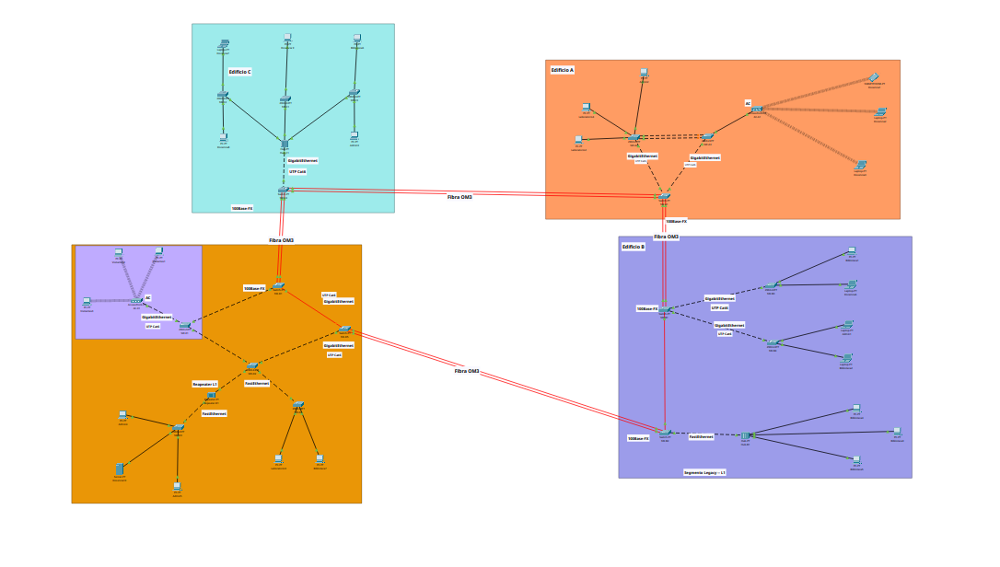

Esta red corporativa integra cuatro edificios principales (A, B, C, D) y un área de visitantes (E) interconectados mediante un backbone de fibra óptica OM3 y enlaces redundantes con EtherChannel.

---

# Topología Etiquetada por Área

## Edificio A

### Descripción General
El Edificio A actúa como nodo central del campus con conexiones críticas hacia Edificios B y C.

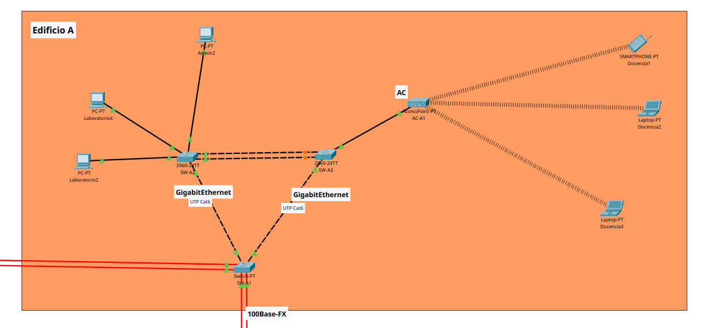

### Conexiones Troncales

| Puerto | Destino | Cable | Tipo |
|--------|---------|-------|------|
| SW-A1 FE4/1 | SW-B1 FE4/1 | Fibra OM3 | EtherChannel 1 |
| SW-A1 FE5/1 | SW-B1 FE5/1 | Fibra OM3 | EtherChannel 1 |
| SW-A1 FE6/1 | SW-C4 FE4/1 | Fibra OM3 | EtherChannel 2 |
| SW-A1 FE7/1 | SW-C4 FE5/1 | Fibra OM3 | EtherChannel 2 |
| SW-A1 GE8/1 | SW-A2 GE0/1 | UTP Cat6 | Troncal |
| SW-A1 GE9/1 | SW-A3 GE0/1 | UTP Cat6 | Troncal |
| SW-A2 GE0/2 | SW-A3 GE0/2 | UTP Cat6 | EtherChannel |
| SW-A2 FE0/24 | SW-A3 FE0/24 | UTP Cat6 | Access |

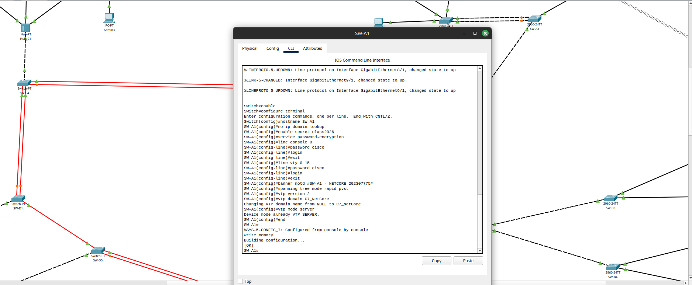

### Conexiones de Usuarios - Edificio A

| Equipo | Puerto | Cable | VLAN |
|--------|--------|-------|------|
| Laboratorio2 | SW-A2 FE0/1 | UTP Cat5e | LABORATORIO (45) |
| Laboratorio4 | SW-A2 FE0/2 | UTP Cat5e | LABORATORIO (45) |
| Admin2 | SW-A2 FE0/3 | UTP Cat5e | ADMIN (15) |
| AC-A1 | SW-A3 FE0/1 | UTP Cat5e | DOCENTES (25) |

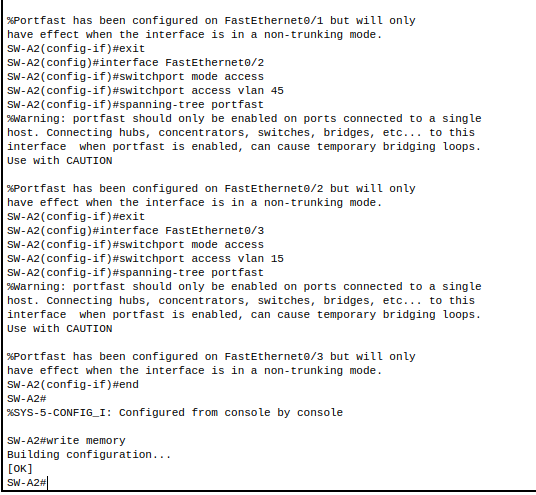

### Dispositivos Inalámbricos - Edificio A

- **Laptop-A1, Laptop-A2, Smartphone-A1** → AC-A1 (Oficina_A) - VLAN DOCENTES

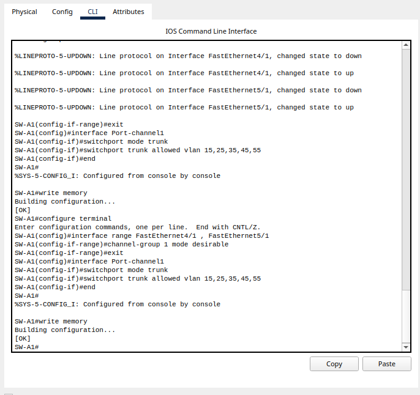

---

## Edificio B

### Descripción General
Edificio B es un nodo distribuidor con múltiples switches conectados en cascada y soporte para dispositivos legacy mediante Hub-B1.

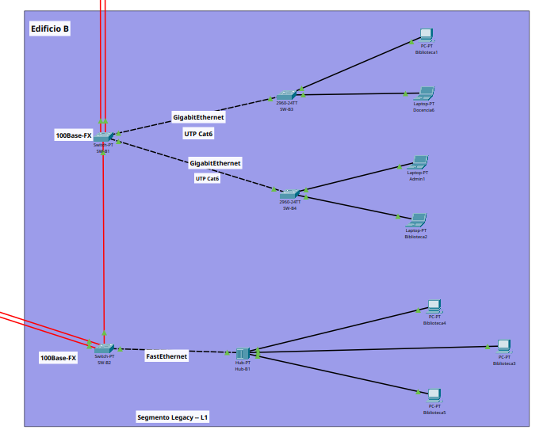

### Estructura de Switches

#### SW-B1 (Nodo Central)
Switch principal con conexiones críticas hacia A, B2, B3 y B4.

| Puerto | Destino | Cable | Tipo |
|--------|---------|-------|------|
| FE4/1 | SW-A1 FE4/1 | Fibra OM3 | EtherChannel 1 |
| FE5/1 | SW-A1 FE5/1 | Fibra OM3 | EtherChannel 1 |
| FE6/1 | SW-B2 FE4/1 | Fibra OM3 | Troncal |
| GE7/1 | SW-B3 GE0/1 | UTP Cat6 | Troncal |
| GE8/1 | SW-B4 GE0/1 | UTP Cat6 | Troncal |

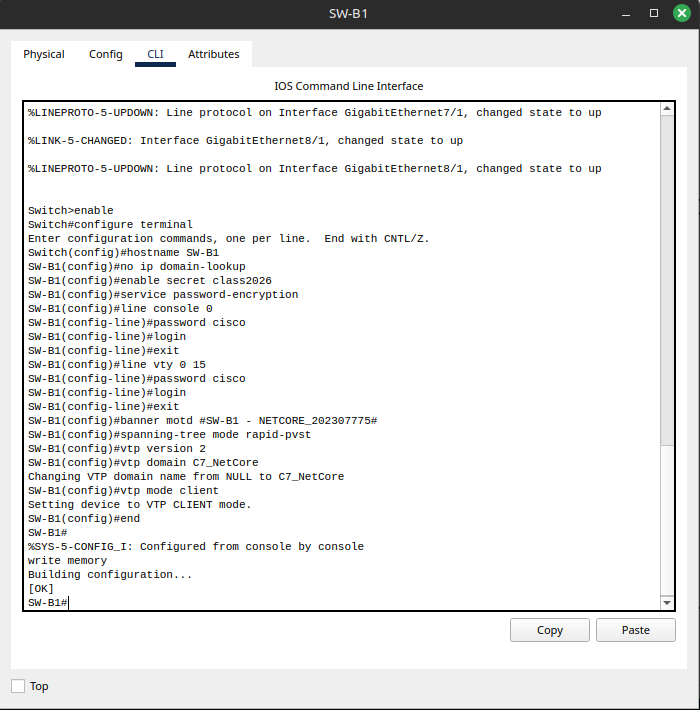
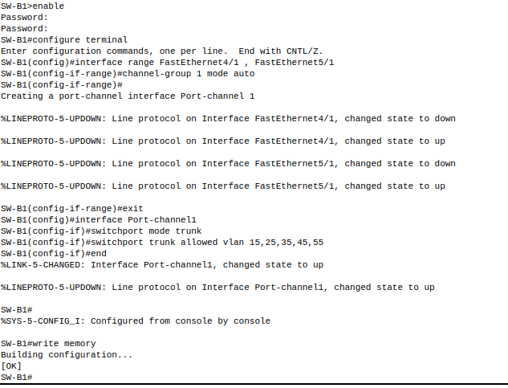

#### SW-B2 (Distribuidor)
Conexiones hacia D5 y gestión de dispositivos legacy.

| Puerto | Destino | Cable | Tipo |
|--------|---------|-------|------|
| FE4/1 | SW-B1 FE6/1 | Fibra OM3 | Troncal |
| FE5/1 | SW-D5 FE5/1 | Fibra OM3 | EtherChannel 4 |
| FE6/1 | SW-D5 FE6/1 | Fibra OM3 | EtherChannel 4 |
| FE0/1 | Hub-B1 Port 1 | UTP Cat5e | Access |

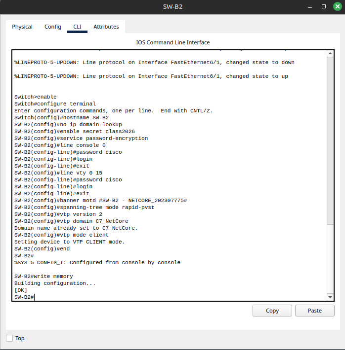
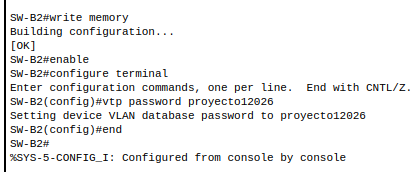

#### SW-B3 (Access - Edificio B)

| Puerto | Destino | VLAN |
|--------|---------|------|
| GE0/1 | SW-B1 (Troncal) | - |
| FE0/1 | host 1 | ADMIN (15) |
| FE0/2 | host 2 | ADMIN (15) |
| FE0/3 | host 3 | ADMIN (15) |

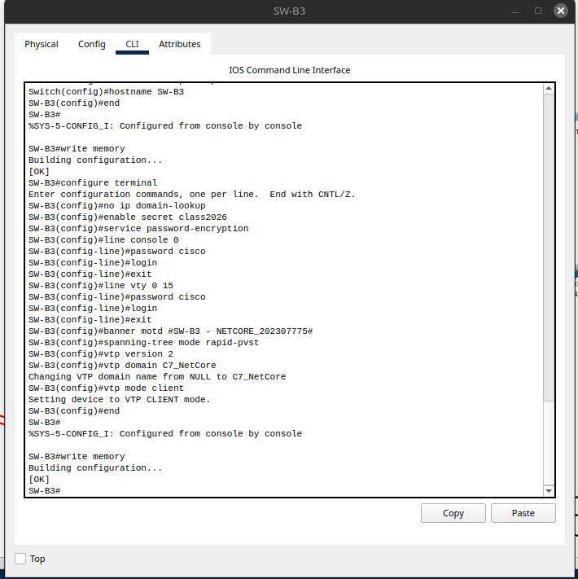
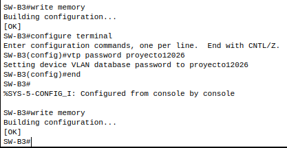

#### SW-B4 (Access - Edificio B)

| Puerto | Destino | VLAN |
|--------|---------|------|
| GE0/1 | SW-B1 (Troncal) | - |
| FE0/1 | host 4 | ADMIN (15) |
| FE0/2 | host 5 | BIBLIOTECA (35) |
| FE0/3 | host 6 | BIBLIOTECA (35) |

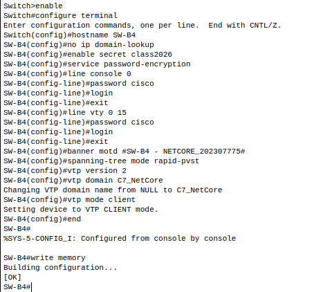
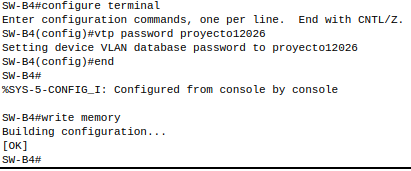

#### Hub-B1 (Dispositivos Legacy)

| Puerto | Destino | VLAN |
|--------|---------|------|
| Port 1 | SW-B2 FE0/1 | BIBLIOTECA (35) |
| Port 2 | host legacy 1 | - |
| Port 3 | host legacy 2 | - |
| Port 4 | host legacy 3 | - |

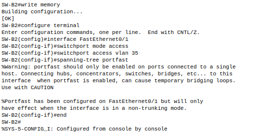

---

## Edificio C

### Descripción General
Edificio C distribuye acceso a través de Hub-C1 con múltiples switches de acceso para departamentos.

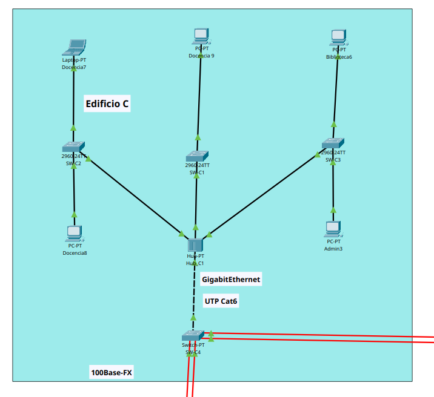

### Estructura de Switches

#### SW-C4 (Nodo Central)

| Puerto | Destino | Cable | Tipo |
|--------|---------|-------|------|
| FE4/1 | SW-A1 FE6/1 | Fibra OM3 | EtherChannel 2 |
| FE5/1 | SW-A1 FE7/1 | Fibra OM3 | EtherChannel 2 |
| FE6/1 | SW-D1 FE4/1 | Fibra OM3 | EtherChannel 3 |
| FE7/1 | SW-D1 FE5/1 | Fibra OM3 | EtherChannel 3 |
| GE8/1 | Hub-C1 Port 1 | UTP Cat6 | Access |

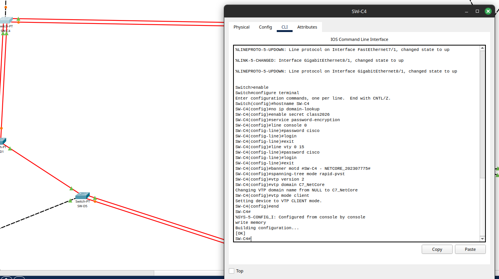
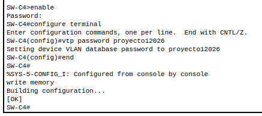

#### Hub-C1 (Distribuidor de Acceso)

| Puerto | Destino | Cable |
|--------|---------|-------|
| Port 1 | SW-C4 GE8/1 | UTP Cat6 |
| Port 2 | SW-C2 FE0/1 | UTP Cat5e |
| Port 3 | SW-C1 FE0/1 | UTP Cat5e |
| Port 4 | SW-C3 FE0/1 | UTP Cat5e |

#### SW-C1 (Acceso - Docencia)

| Puerto | Destino | VLAN |
|--------|---------|------|
| FE0/1 | Hub-C1 Port 3 | - |
| FE0/2 | Docencia9 | DOCENTES (25) |

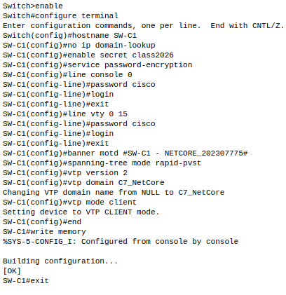

#### SW-C2 (Acceso - Docencia)

| Puerto | Destino | VLAN |
|--------|---------|------|
| FE0/1 | Hub-C1 Port 2 | - |
| FE0/2 | Docencia7 | DOCENTES (25) |
| FE0/3 | Docencia8 | DOCENTES (25) |

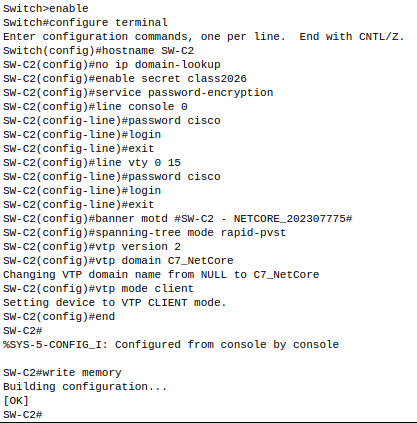
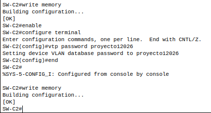

#### SW-C3 (Acceso - Biblioteca y Admin)

| Puerto | Destino | VLAN |
|--------|---------|------|
| FE0/1 | Hub-C1 Port 4 | - |
| FE0/2 | Biblioteca6 | BIBLIOTECA (35) |
| FE0/3 | Admin3 | ADMIN (15) |


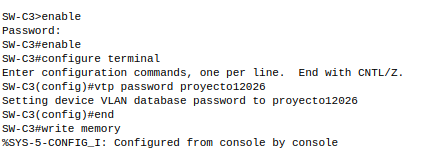

---

## Edificio D

### Descripción General
Edificio D es el segundo nodo distribuidor con conexiones hacia E (visitantes) y múltiples switches para departamentos.

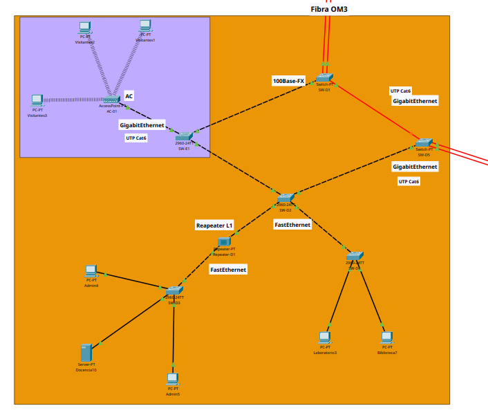

### Estructura de Switches

#### SW-D1 (Nodo Central)

| Puerto | Destino | Cable | Tipo |
|--------|---------|-------|------|
| FE4/1 | SW-C4 FE6/1 | Fibra OM3 | EtherChannel 3 |
| FE5/1 | SW-C4 FE7/1 | Fibra OM3 | EtherChannel 3 |
| FE6/1 | SW-D5 FE6/1 | Fibra OM3 | Troncal |
| FE0/1 | SW-E1 FE0/1 | UTP Cat5e | Access |

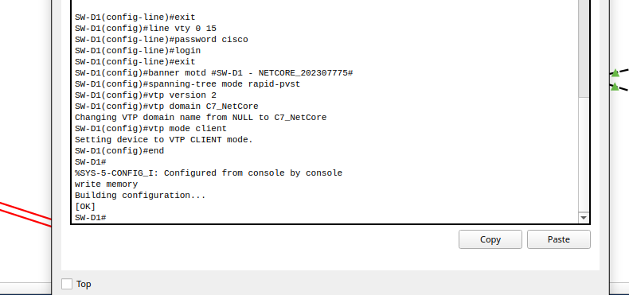
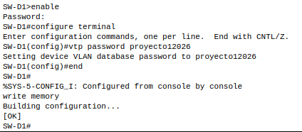

#### SW-D5 (Distribuidor)

| Puerto | Destino | Cable | Tipo |
|--------|---------|-------|------|
| FE4/1 | SW-B2 FE5/1 | Fibra OM3 | EtherChannel 4 |
| FE5/1 | SW-B2 FE6/1 | Fibra OM3 | EtherChannel 4 |
| FE6/1 | SW-D1 FE6/1 | Fibra OM3 | Troncal |
| GE7/1 | SW-D2 GE0/1 | UTP Cat6 | Troncal |

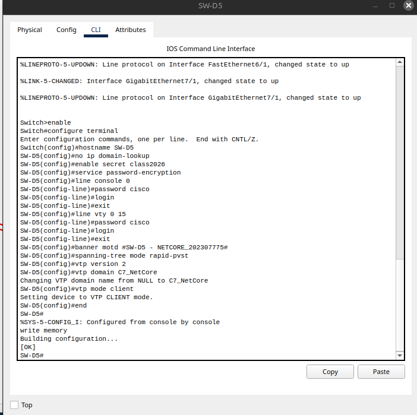
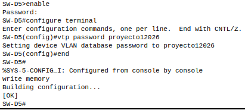

#### SW-D2 (Distribuidor Local)

| Puerto | Destino | Cable | Tipo |
|--------|---------|-------|------|
| GE0/1 | SW-D5 GE7/1 | UTP Cat6 | Troncal |
| FE0/1 | SW-E1 FE0/2 | UTP Cat5e | Access |
| FE0/2 | Repeater-D1 Port 1 | UTP Cat5e | Access |
| FE0/3 | SW-D4 FE0/1 | UTP Cat5e | Access |

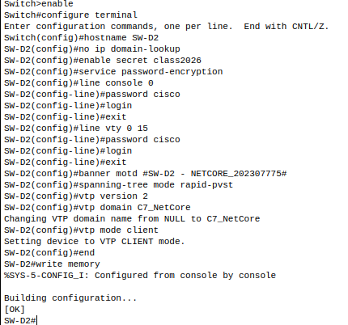
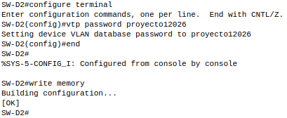

#### Repeater-D1 (Extensión de Red)

| Puerto | Destino |
|--------|---------|
| Port 1 | SW-D2 FE0/2 |
| Port 2 | SW-D3 FE0/1 |

#### SW-D3 (Acceso - Múltiples Departamentos)

| Puerto | Destino | VLAN |
|--------|---------|------|
| FE0/1 | Repeater-D1 Port 2 | - |
| FE0/2 | Laboratorio / host 1 | LABORATORIO (45) |
| FE0/3 | Biblioteca / host 1 | BIBLIOTECA (35) |
| FE0/4 | Administración / host 1 | ADMIN (15) |

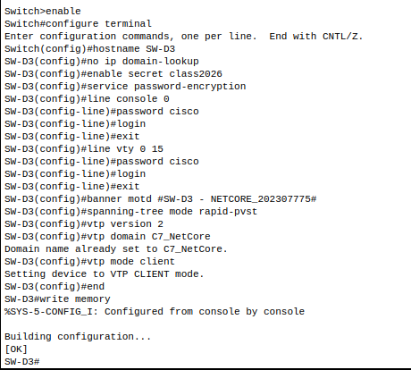
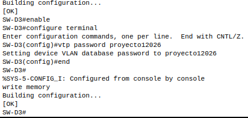

#### SW-D4 (Acceso - Múltiples Departamentos)

| Puerto | Destino | VLAN |
|--------|---------|------|
| FE0/1 | SW-D2 FE0/3 | - |
| FE0/2 | Laboratorio / host 2 | LABORATORIO (45) |
| FE0/3 | Biblioteca / host 2 | BIBLIOTECA (35) |
| FE0/4 | Administración / host 2 | ADMIN (15) |

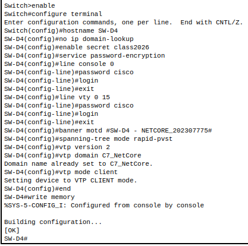
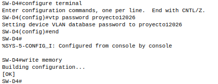

---

## Edificio E - Zona de Visitantes

### Descripción General
Edificio E proporciona conectividad inalámbrica segregada para visitantes.

#### SW-E1 (Access Point Controller)

| Puerto | Destino | Cable | VLAN |
|--------|---------|-------|------|
| FE0/1 | SW-D1 FE0/1 | UTP Cat5e | VISITANTE (55) |
| FE0/2 | SW-D2 FE0/1 | UTP Cat5e | VISITANTE (55) |
| GE0/1 | AC-D1 GE0 | UTP Cat6 | VISITANTE (55) |

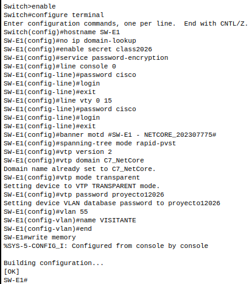

### Dispositivos Inalámbricos - Visitantes

- **Laptop visitante** → AC-D1 - VLAN VISITANTE (55)
- **Smartphone visitante** → AC-D1 - VLAN VISITANTE (55)

---

## Configuración del Backbone

### Descripción General

El backbone utiliza un modelo de tres capas:
- **Capa Core:** SW-A1 (raíz), SW-B1, SW-C4
- **Capa Distribución:** SW-D1, SW-D5
- **Capa Acceso:** Todos los demás switches

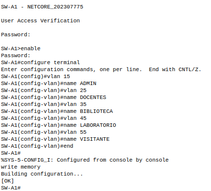

### Configuración Base - SW-A1

```cisco
enable
configure terminal
hostname SW-A1
no ip domain-lookup
enable secret class2026
service password-encryption
line console 0
password cisco
login
exit
line vty 0 15
password cisco
login
exit
banner motd #SW-A1 - NETCORE_202307775#
spanning-tree mode rapid-pvst
vtp version 2
vtp domain C7_NetCore
vtp mode server
end
write memory
```


### Configuración Base - SW-B1

```cisco
enable
configure terminal
hostname SW-B1
no ip domain-lookup
enable secret class2026
service password-encryption
line console 0
password cisco
login
exit
line vty 0 15
password cisco
login
exit
banner motd #SW-B1 - NETCORE_202307775#
spanning-tree mode rapid-pvst
vtp version 2
vtp domain C7_NetCore
vtp mode client
end
write memory
```


### Configuración Base - SW-C4

```cisco
enable
configure terminal
hostname SW-C4
no ip domain-lookup
enable secret class2026
service password-encryption
line console 0
password cisco
login
exit
line vty 0 15
password cisco
login
exit
banner motd #SW-C4 - NETCORE_202307775#
spanning-tree mode rapid-pvst
vtp version 2
vtp domain C7_NetCore
vtp mode client
end
write memory
```

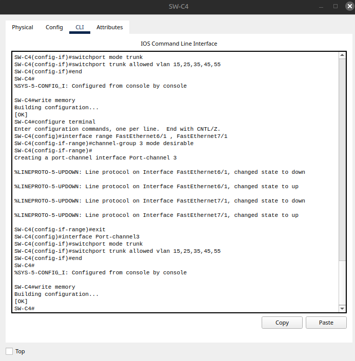

### Configuración Base - SW-D1

```cisco
enable
configure terminal
hostname SW-D1
no ip domain-lookup
enable secret class2026
service password-encryption
line console 0
password cisco
login
exit
line vty 0 15
password cisco
login
exit
banner motd #SW-D1 - NETCORE_202307775#
spanning-tree mode rapid-pvst
vtp version 2
vtp domain C7_NetCore
vtp mode client
end
write memory
```

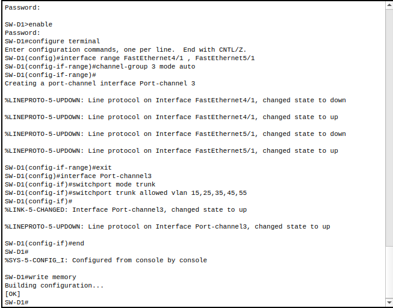

### Configuración Base - SW-D5

```cisco
enable
configure terminal
hostname SW-D5
no ip domain-lookup
enable secret class2026
service password-encryption
line console 0
password cisco
login
exit
line vty 0 15
password cisco
login
exit
banner motd #SW-D5 - NETCORE_202307775#
spanning-tree mode rapid-pvst
vtp version 2
vtp domain C7_NetCore
vtp mode client
end
write memory
```

### Contraseña VTP - Todos los Switches Backbone

Aplicar en: SW-A1, SW-B1, SW-C4, SW-D1, SW-D5

```cisco
enable
configure terminal
vtp password proyecto12026
end
write memory
```

---

## Configuración de VLANs

### Creación de VLANs - SW-A1 (VTP Server)

```cisco
enable
configure terminal
vlan 15
name ADMIN
vlan 25
name DOCENTES
vlan 35
name BIBLIOTECA
vlan 45
name LABORATORIO
vlan 55
name VISITANTE
end
write memory
```

| VLAN ID | Nombre | Propósito |
|---------|--------|----------|
| 15 | ADMIN | Personal administrativo |
| 25 | DOCENTES | Docentes y oficinas académicas |
| 35 | BIBLIOTECA | Biblioteca y recursos compartidos |
| 45 | LABORATORIO | Laboratorios y equipo especializado |
| 55 | VISITANTE | Acceso de visitantes (segregado) |

### Configuración Root Bridge

```cisco
enable
configure terminal
spanning-tree vlan 15,25,35,45,55 priority 4096
end
write memory
```

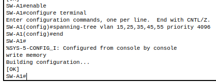

---

## EtherChannel Core

### Propósito
Los EtherChannels proporcionan redundancia y ancho de banda adicional en el backbone, utilizando LACP.

### EtherChannel 1: SW-A1 ↔ SW-B1

#### Configuración SW-A1
```cisco
enable
configure terminal
interface range FastEthernet4/1 , FastEthernet5/1
channel-group 1 mode desirable
exit
interface Port-channel1
switchport mode trunk
switchport trunk allowed vlan 15,25,35,45,55
end
write memory
```

#### Configuración SW-B1
```cisco
enable
configure terminal
interface range FastEthernet4/1 , FastEthernet5/1
channel-group 1 mode auto
exit
interface Port-channel1
switchport mode trunk
switchport trunk allowed vlan 15,25,35,45,55
end
write memory
```


### EtherChannel 2: SW-A1 ↔ SW-C4

#### Configuración SW-A1
```cisco
enable
configure terminal
interface range FastEthernet6/1 , FastEthernet7/1
channel-group 2 mode desirable
exit
interface Port-channel2
switchport mode trunk
switchport trunk allowed vlan 15,25,35,45,55
end
write memory
```

#### Configuración SW-C4
```cisco
enable
configure terminal
interface range FastEthernet4/1 , FastEthernet5/1
channel-group 2 mode auto
exit
interface Port-channel2
switchport mode trunk
switchport trunk allowed vlan 15,25,35,45,55
end
write memory
```


### EtherChannel 3: SW-C4 ↔ SW-D1

#### Configuración SW-C4
```cisco
enable
configure terminal
interface range FastEthernet6/1 , FastEthernet7/1
channel-group 3 mode desirable
exit
interface Port-channel3
switchport mode trunk
switchport trunk allowed vlan 15,25,35,45,55
end
write memory
```

#### Configuración SW-D1
```cisco
enable
configure terminal
interface range FastEthernet4/1 , FastEthernet5/1
channel-group 3 mode auto
exit
interface Port-channel3
switchport mode trunk
switchport trunk allowed vlan 15,25,35,45,55
end
write memory
```

### EtherChannel 4: SW-B2 ↔ SW-D5

#### Configuración SW-B2
```cisco
enable
configure terminal
interface range FastEthernet5/1 , FastEthernet6/1
channel-group 4 mode desirable
exit
interface Port-channel4
switchport mode trunk
switchport trunk allowed vlan 15,25,35,45,55
end
write memory
```

#### Configuración SW-D5
```cisco
enable
configure terminal
interface range FastEthernet5/1 , FastEthernet6/1
channel-group 4 mode desirable
exit
interface Port-channel4
switchport mode trunk
switchport trunk allowed vlan 15,25,35,45,55
end
write memory
```

---

## Configuraciones Específicas por Switch

### SW-A2 (Access - Edificio A)

#### Configuración Base
```cisco
enable
configure terminal
hostname SW-A2
no ip domain-lookup
enable secret class2026
service password-encryption
line console 0
password cisco
login
exit
line vty 0 15
password cisco
login
exit
banner motd #SW-A2 - NETCORE_202307775#
spanning-tree mode rapid-pvst
vtp version 2
vtp domain C7_NetCore
vtp mode client
end
write memory
```

#### Contraseña VTP
```cisco
enable
configure terminal
vtp password proyecto12026
end
write memory
```

#### Puertos Access
```cisco
enable
configure terminal
interface FastEthernet0/1
switchport mode access
switchport access vlan 45
spanning-tree portfast
exit
interface FastEthernet0/2
switchport mode access
switchport access vlan 45
spanning-tree portfast
exit
interface FastEthernet0/3
switchport mode access
switchport access vlan 15
spanning-tree portfast
end
write memory
```


---

### SW-A3 (Access - Edificio A)

#### Configuración Base
```cisco
enable
configure terminal
hostname SW-A3
no ip domain-lookup
enable secret class2026
service password-encryption
line console 0
password cisco
login
exit
line vty 0 15
password cisco
login
exit
banner motd #SW-A3 - NETCORE_202307775#
spanning-tree mode rapid-pvst
vtp version 2
vtp domain C7_NetCore
vtp mode client
vtp password proyecto12026
end
write memory
```

#### Troncal hacia SW-A1
```cisco
configure terminal
interface GigabitEthernet0/1
switchport mode trunk
switchport trunk allowed vlan 15,25,35,45,55
end
write memory
```

#### Puertos Access
```cisco
enable
configure terminal
interface FastEthernet0/1
switchport mode access
switchport access vlan 25
spanning-tree portfast
end
write memory
```

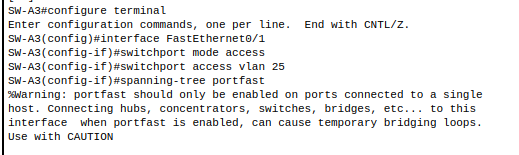

---

### SW-B2 (Distribución - Edificio B)

#### Configuración Base
```cisco
enable
configure terminal
hostname SW-B2
no ip domain-lookup
enable secret class2026
service password-encryption
line console 0
password cisco
login
exit
line vty 0 15
password cisco
login
exit
banner motd #SW-B2 - NETCORE_202307775#
spanning-tree mode rapid-pvst
vtp version 2
vtp domain C7_NetCore
vtp mode client
end
write memory
```

#### Contraseña VTP
```cisco
enable
configure terminal
vtp password proyecto12026
end
write memory
```

#### Troncal hacia SW-B1
```cisco
enable
configure terminal
interface FastEthernet4/1
switchport mode trunk
switchport trunk allowed vlan 15,25,35,45,55
end
write memory
```

#### Puerto Access - Hub-B1
```cisco
enable
configure terminal
interface FastEthernet0/1
switchport mode access
switchport access vlan 35
spanning-tree portfast
end
write memory
```

---

### SW-B3 (Access - Edificio B)

#### Configuración Base
```cisco
enable
configure terminal
hostname SW-B3
no ip domain-lookup
enable secret class2026
service password-encryption
line console 0
password cisco
login
exit
line vty 0 15
password cisco
login
exit
banner motd #SW-B3 - NETCORE_202307775#
spanning-tree mode rapid-pvst
vtp version 2
vtp domain C7_NetCore
vtp mode client
end
write memory
```

#### Contraseña VTP
```cisco
enable
configure terminal
vtp password proyecto12026
end
write memory
```

#### Troncal
```cisco
enable
configure terminal
interface GigabitEthernet0/1
switchport mode trunk
switchport trunk allowed vlan 15,25,35,45,55
end
write memory
```

---

### SW-B4 (Access - Edificio B)

#### Configuración Base
```cisco
enable
configure terminal
hostname SW-B4
no ip domain-lookup
enable secret class2026
service password-encryption
line console 0
password cisco
login
exit
line vty 0 15
password cisco
login
exit
banner motd #SW-B4 - NETCORE_202307775#
spanning-tree mode rapid-pvst
vtp version 2
vtp domain C7_NetCore
vtp mode client
end
write memory
```

#### Contraseña VTP
```cisco
enable
configure terminal
vtp password proyecto12026
end
write memory
```

#### Troncal hacia SW-B1
```cisco
enable
configure terminal
interface GigabitEthernet0/1
switchport mode trunk
switchport trunk allowed vlan 15,25,35,45,55
end
write memory
```

#### Puertos Access
```cisco
enable
configure terminal
interface FastEthernet0/1
switchport mode access
switchport access vlan 15
spanning-tree portfast
exit
interface FastEthernet0/2
switchport mode access
switchport access vlan 35
spanning-tree portfast
end
write memory
```

---

### SW-C1 (Access - Edificio C)

#### Configuración Base
```cisco
enable
configure terminal
hostname SW-C1
no ip domain-lookup
enable secret class2026
service password-encryption
line console 0
password cisco
login
exit
line vty 0 15
password cisco
login
exit
banner motd #SW-C1 - NETCORE_202307775#
spanning-tree mode rapid-pvst
vtp version 2
vtp domain C7_NetCore
vtp mode client
end
write memory
```

#### Contraseña VTP
```cisco
configure terminal
vtp password proyecto12026
end
write memory
```

---

### SW-C2 (Access - Edificio C)

#### Configuración Base
```cisco
enable
configure terminal
hostname SW-C2
no ip domain-lookup
enable secret class2026
service password-encryption
line console 0
password cisco
login
exit
line vty 0 15
password cisco
login
exit
banner motd #SW-C2 - NETCORE_202307775#
spanning-tree mode rapid-pvst
vtp version 2
vtp domain C7_NetCore
vtp mode client
end
write memory
```

#### Contraseña VTP
```cisco
enable
configure terminal
vtp password proyecto12026
end
write memory
```

#### Puertos Access
```cisco
enable
configure terminal
interface FastEthernet0/1
switchport mode access
switchport access vlan 15
spanning-tree portfast
exit
interface FastEthernet0/2
switchport mode access
switchport access vlan 25
spanning-tree portfast
exit
end
write memory
```

---

### SW-C3 (Access - Edificio C)

#### Configuración Base
```cisco
enable
configure terminal
hostname SW-C3
no ip domain-lookup
enable secret class2026
service password-encryption
line console 0
password cisco
login
exit
line vty 0 15
password cisco
login
exit
banner motd #SW-C3 - NETCORE_202307775#
spanning-tree mode rapid-pvst
vtp version 2
vtp domain C7_NetCore
vtp mode client
end
write memory
```

#### Contraseña VTP
```cisco
enable
configure terminal
vtp password proyecto12026
end
write memory
```

#### Troncal
```cisco
configure terminal
interface GigabitEthernet0/1
switchport mode trunk
switchport trunk allowed vlan 15,25,35,45,55
end
write memory
```

---

### SW-D2 (Distribución - Edificio D)

#### Configuración Base
```cisco
enable
configure terminal
hostname SW-D2
no ip domain-lookup
enable secret class2026
service password-encryption
line console 0
password cisco
login
exit
line vty 0 15
password cisco
login
exit
banner motd #SW-D2 - NETCORE_202307775#
spanning-tree mode rapid-pvst
vtp version 2
vtp domain C7_NetCore
vtp mode client
end
write memory
```

#### Contraseña VTP
```cisco
enable
configure terminal
vtp password proyecto12026
end
write memory
```

---

### SW-D3 (Access - Edificio D)

#### Configuración Base
```cisco
enable
configure terminal
hostname SW-D3
no ip domain-lookup
enable secret class2026
service password-encryption
line console 0
password cisco
login
exit
line vty 0 15
password cisco
login
exit
banner motd #SW-D3 - NETCORE_202307775#
spanning-tree mode rapid-pvst
vtp version 2
vtp domain C7_NetCore
vtp mode client
end
write memory
```

#### Contraseña VTP
```cisco
enable
configure terminal
vtp password proyecto12026
end
write memory
```

#### Troncal hacia SW-D2
```cisco
enable
configure terminal
interface FastEthernet0/1
switchport mode trunk
switchport trunk allowed vlan 15,25,35,45,55
end
write memory
```

#### Puertos Access
```cisco
enable
configure terminal
interface FastEthernet0/2
switchport mode access
switchport access vlan 15
spanning-tree portfast
exit
interface FastEthernet0/3
switchport mode access
switchport access vlan 25
spanning-tree portfast
end
write memory
```

---

### SW-D4 (Access - Edificio D)

#### Configuración Base
```cisco
enable
configure terminal
hostname SW-D4
no ip domain-lookup
enable secret class2026
service password-encryption
line console 0
password cisco
login
exit
line vty 0 15
password cisco
login
exit
banner motd #SW-D4 - NETCORE_202307775#
spanning-tree mode rapid-pvst
vtp version 2
vtp domain C7_NetCore
vtp mode client
end
write memory
```

#### Contraseña VTP
```cisco
enable
configure terminal
vtp password proyecto12026
end
write memory
```

#### Puertos Access
```cisco
enable
configure terminal
interface FastEthernet0/2
switchport mode access
switchport access vlan 45
spanning-tree portfast
exit
interface FastEthernet0/3
switchport mode access
switchport access vlan 35
spanning-tree portfast
end
write memory
```

---

### SW-E1 (Visitantes - Edificio E)

#### Configuración Base
```cisco
enable
configure terminal
hostname SW-E1
no ip domain-lookup
enable secret class2026
service password-encryption
line console 0
password cisco
login
exit
line vty 0 15
password cisco
login
exit
banner motd #SW-E1 - NETCORE_202307775#
spanning-tree mode rapid-pvst
vtp version 2
vtp domain C7_NetCore
vtp mode transparent
vtp password proyecto12026
vlan 55
name VISITANTE
end
write memory
```

#### Trunks hacia SW-D1 y SW-D2
```cisco
enable
configure terminal
interface FastEthernet0/1
switchport mode trunk
switchport trunk allowed vlan 55
exit
interface FastEthernet0/2
switchport mode trunk
switchport trunk allowed vlan 55
end
write memory
```

#### Puerto Access para AC-D1
```cisco
enable
configure terminal
interface GigabitEthernet0/1
switchport mode access
switchport access vlan 55
spanning-tree portfast
end
write memory
```

---

## Resumen de Tecnologías Implementadas

| Tecnología | Descripción | Implementación |
|------------|-------------|-----------------|
| **VLAN** | Segmentación lógica de red | 5 VLANs (Admin, Docentes, Biblioteca, Lab, Visitante) |
| **STP/RSTP** | Prevención de bucles | RAPID-PVST |
| **VTP** | Gestión centralizada de VLANs | Server/Client/Transparent |
| **EtherChannel** | Redundancia y agregación | 4 canales activos en backbone |
| **Fibra Óptica** | Backbone de alta velocidad | OM3 multi-modo |
| **Cat6 UTP** | Conexiones troncales | GigabitEthernet |
| **Cat5e UTP** | Acceso de usuarios | FastEthernet |
| **Wireless** | Acceso inalámbrico | Access Points (AC-A1, AC-D1) |

---

# Tabla de Dominios de Colisión

## Criterio usado
- **Switch ↔ dispositivo final** = 1 dominio de colisión por puerto
- **Switch ↔ switch** = 1 dominio de colisión por enlace físico
- **Hub** = todos los equipos conectados al hub comparten **un mismo dominio de colisión**
- **Repeater** = extiende **un mismo dominio de colisión**
- **WiFi/AP** = la celda inalámbrica se considera **un dominio compartido**

## Resumen
- **Total de dominios de colisión: 43**

| # | Dominio de colisión | Tipo |
|---|---|---|
| 1 | SW-A1 Fa4/1 ↔ SW-B1 Fa4/1 | Enlace punto a punto |
| 2 | SW-A1 Fa5/1 ↔ SW-B1 Fa5/1 | Enlace punto a punto |
| 3 | SW-A1 Fa6/1 ↔ SW-C4 Fa4/1 | Enlace punto a punto |
| 4 | SW-A1 Fa7/1 ↔ SW-C4 Fa5/1 | Enlace punto a punto |
| 5 | SW-C4 Fa6/1 ↔ SW-D1 Fa4/1 | Enlace punto a punto |
| 6 | SW-C4 Fa7/1 ↔ SW-D1 Fa5/1 | Enlace punto a punto |
| 7 | SW-B2 Fa5/1 ↔ SW-D5 Fa4/1 | Enlace punto a punto |
| 8 | SW-B2 Fa6/1 ↔ SW-D5 Fa5/1 | Enlace punto a punto |
| 9 | SW-D1 Fa6/1 ↔ SW-D5 Fa6/1 | Enlace punto a punto |
| 10 | SW-A1 Gi8/1 ↔ SW-A2 Gi0/1 | Enlace punto a punto |
| 11 | SW-A1 Gi9/1 ↔ SW-A3 Gi0/1 | Enlace punto a punto |
| 12 | SW-A2 Fa0/23 ↔ SW-A3 Fa0/23 | Enlace punto a punto |
| 13 | SW-A2 Fa0/24 ↔ SW-A3 Fa0/24 | Enlace punto a punto |
| 14 | SW-A2 Fa0/1 ↔ Laboratorio4 | Acceso |
| 15 | SW-A2 Fa0/2 ↔ Laboratorio2 | Acceso |
| 16 | SW-A2 Fa0/3 ↔ Admin2 | Acceso |
| 17 | SW-A3 Fa0/1 ↔ AC-A1 | Acceso |
| 18 | AC-A1 ↔ Docencia1, Docencia2, Docencia3 | Inalámbrico compartido |
| 19 | SW-B1 Fa6/1 ↔ SW-B2 Fa4/1 | Enlace punto a punto |
| 20 | SW-B1 Gi7/1 ↔ SW-B3 Gi0/1 | Enlace punto a punto |
| 21 | SW-B1 Gi8/1 ↔ SW-B4 Gi0/1 | Enlace punto a punto |
| 22 | SW-B2 Fa0/1 ↔ Hub-B1 ↔ Biblioteca3, Biblioteca4, Biblioteca5 | Hub compartido |
| 23 | SW-B3 Fa0/1 ↔ Biblioteca1 | Acceso |
| 24 | SW-B3 Fa0/2 ↔ Docencia6 | Acceso |
| 25 | SW-B4 Fa0/1 ↔ Admin1 | Acceso |
| 26 | SW-B4 Fa0/2 ↔ Biblioteca2 | Acceso |
| 27 | SW-C4 Gi8/1 ↔ Hub-C1 ↔ SW-C1 Fa0/1 ↔ SW-C2 Fa0/1 ↔ SW-C3 Fa0/1 | Hub compartido |
| 28 | SW-C1 Fa0/3 ↔ Docencia9 | Acceso |
| 29 | SW-C2 Fa0/2 ↔ Docencia7 | Acceso |
| 30 | SW-C2 Fa0/3 ↔ Docencia8 | Acceso |
| 31 | SW-C3 Fa0/2 ↔ Biblioteca6 | Acceso |
| 32 | SW-C3 Fa0/3 ↔ Admin3 | Acceso |
| 33 | SW-D5 Gi7/1 ↔ SW-D2 Gi0/1 | Enlace punto a punto |
| 34 | SW-D1 Fa0/1 ↔ SW-E1 Fa0/1 | Enlace punto a punto |
| 35 | SW-D2 Fa0/1 ↔ SW-E1 Fa0/2 | Enlace punto a punto |
| 36 | SW-D2 Fa0/2 ↔ Repeater-D1 ↔ SW-D3 Fa0/1 | Repeater compartido |
| 37 | SW-D2 Fa0/3 ↔ SW-D4 Fa0/1 | Enlace punto a punto |
| 38 | SW-E1 Gi0/1 ↔ AC-D1 | Acceso |
| 39 | SW-D3 Fa0/2 ↔ Admin4 | Acceso |
| 40 | SW-D3 Fa0/3 ↔ Server Docencia10 | Acceso |
| 41 | SW-D4 Fa0/2 ↔ Laboratorio3 | Acceso |
| 42 | SW-D4 Fa0/3 ↔ Biblioteca7 | Acceso |
| 43 | AC-D1 ↔ Visitante1, Visitante2, Visitante3 | Inalámbrico compartido |

## Tabla de Dominios de Broadcast (una por VLAN)

| VLAN ID | Nombre | Dominio de Broadcast | Dispositivos Incluidos |
|---------|--------|---------------------|------------------------|
| 15 | ADMIN | 192.168.15.0/24 | Admin1, Admin2, Admin3, Admin4, Admin5 |
| 25 | DOCENTES | 192.168.25.0/24 | Docencia1, Docencia2, Docencia3, Docencia6, Docencia7, Docencia8, Docencia9, Docencia10 |
| 35 | BIBLIOTECA | 192.168.35.0/24 | Biblioteca1, Biblioteca2, Biblioteca3, Biblioteca4, Biblioteca5, Biblioteca6, Biblioteca7 |
| 45 | LABORATORIO | 192.168.45.0/24 | Laboratorio2, Laboratorio3, Laboratorio4 |
| 55 | VISITANTE | 192.168.55.0/24 | Visitante1, Visitante2, Visitante3, AC-D1 |

### Consideraciones sobre Dominios de Broadcast

- Cada VLAN forma un **dominio de broadcast independiente**
- Los broadcasts en una VLAN **no se propagan** a otras VLANs
- El router/Layer 3 es necesario para comunicación entre VLANs
- En esta topología funciona a **Capa 2**, sin routing inter-VLAN configurado
- Las APs inalámbricos (AC-A1, AC-D1) comparten el dominio de broadcast de su respectiva VLAN

## Notas
- Aunque algunos enlaces estén en **trunk** o en **EtherChannel**, cada **enlace físico** sigue representando su propio dominio de colisión.
- Los segmentos con **Hub** y **Repeater** son los únicos donde varios dispositivos comparten un mismo dominio de colisión.
- Los puertos de switch conectados a equipos finales crean dominios de colisión independientes.

---

# Tabla de Dominios de Broadcast (una por VLAN)

| VLAN ID | Nombre | Dominio de Broadcast | Dispositivos Incluidos |
|---------|--------|---------------------|------------------------|
| 15 | ADMIN | 192.168.15.0/24 | Admin1, Admin2, Admin3, Admin4, Admin5 |
| 25 | DOCENTES | 192.168.25.0/24 | Docencia1, Docencia2, Docencia3, Docencia6, Docencia7, Docencia8, Docencia9, Docencia10 |
| 35 | BIBLIOTECA | 192.168.35.0/24 | Biblioteca1, Biblioteca2, Biblioteca3, Biblioteca4, Biblioteca5, Biblioteca6, Biblioteca7 |
| 45 | LABORATORIO | 192.168.45.0/24 | Laboratorio2, Laboratorio3, Laboratorio4 |
| 55 | VISITANTE | 192.168.55.0/24 | Visitante1, Visitante2, Visitante3, AC-D1 |

### Consideraciones sobre Dominios de Broadcast

- Cada VLAN forma un **dominio de broadcast independiente**
- Los broadcasts en una VLAN **no se propagan** a otras VLANs
- El router/Layer 3 es necesario para comunicación entre VLANs
- En esta topología funciona a **Capa 2**, sin routing inter-VLAN configurado
- Las APs inalámbricos (AC-A1, AC-D1) comparten el dominio de broadcast de su respectiva VLAN

---

# Tabla de Direccionamiento IP

## Parámetros Generales
- Máscara para todos los equipos: `255.255.255.0`
- Gateway por ahora: **vacío**
- Proyecto funcionando a nivel de **Capa 2**
- VLAN 15 → `192.168.15.0/24`
- VLAN 25 → `192.168.25.0/24`
- VLAN 35 → `192.168.35.0/24`
- VLAN 45 → `192.168.45.0/24`
- VLAN 55 → `192.168.55.0/24`

## VLAN 15 - ADMIN
| Equipo | IP |
|---|---|
| Admin1 | 192.168.15.75 |
| Admin2 | 192.168.15.76 |
| Admin3 | 192.168.15.77 |
| Admin4 | 192.168.15.78 |
| Admin5 | 192.168.15.79 |

## VLAN 25 - DOCENTES
| Equipo | IP |
|---|---|
| Docencia1 | 192.168.25.75 |
| Docencia2 | 192.168.25.76 |
| Docencia3 | 192.168.25.77 |
| Docencia6 | 192.168.25.78 |
| Docencia7 | 192.168.25.79 |
| Docencia8 | 192.168.25.80 |
| Docencia9 | 192.168.25.81 |
| Docencia10 | 192.168.25.82 |

## VLAN 35 - BIBLIOTECA
| Equipo | IP |
|---|---|
| Biblioteca1 | 192.168.35.75 |
| Biblioteca2 | 192.168.35.76 |
| Biblioteca3 | 192.168.35.77 |
| Biblioteca4 | 192.168.35.78 |
| Biblioteca5 | 192.168.35.79 |
| Biblioteca6 | 192.168.35.80 |
| Biblioteca7 | 192.168.35.81 |

## VLAN 45 - LABORATORIO
| Equipo | IP |
|---|---|
| Laboratorio2 | 192.168.45.75 |
| Laboratorio3 | 192.168.45.76 |
| Laboratorio4 | 192.168.45.77 |

## VLAN 55 - VISITANTES
| Equipo | IP |
|---|---|
| Visitante1 | 192.168.55.75 |
| Visitante2 | 192.168.55.76 |
| Visitante3 | 192.168.55.77 |

---

# Tabla de VLANs

| VLAN ID | Nombre | Propósito |
|---------|--------|----------|
| 15 | ADMIN | Personal administrativo |
| 25 | DOCENTES | Docentes y oficinas académicas |
| 35 | BIBLIOTECA | Biblioteca y recursos compartidos |
| 45 | LABORATORIO | Laboratorios y equipo especializado |
| 55 | VISITANTE | Acceso de visitantes (segregado) |

---

# Pruebas de Ping

## Objetivo
Validar la conectividad dentro de cada VLAN y verificar la segmentación de broadcast entre VLANs distintas.

## Resultados de Pruebas (2 por VLAN: 1 Exitoso + 1 Fallido)

### VLAN 15 - ADMIN

#### Prueba 1: Ping Exitoso (dentro de VLAN 15)
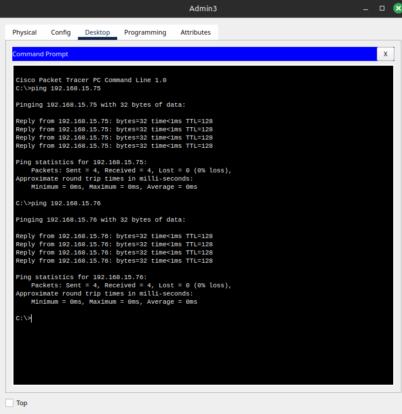

**Descripción:** Admin1 realiza ping a Admin2 - ambos en VLAN 15 (192.168.15.0/24)  
**Resultado:** Éxito - Conectividad comprobada dentro de VLAN 15

#### Prueba 2: Ping Fallido (entre VLAN 15 y VLAN 25)
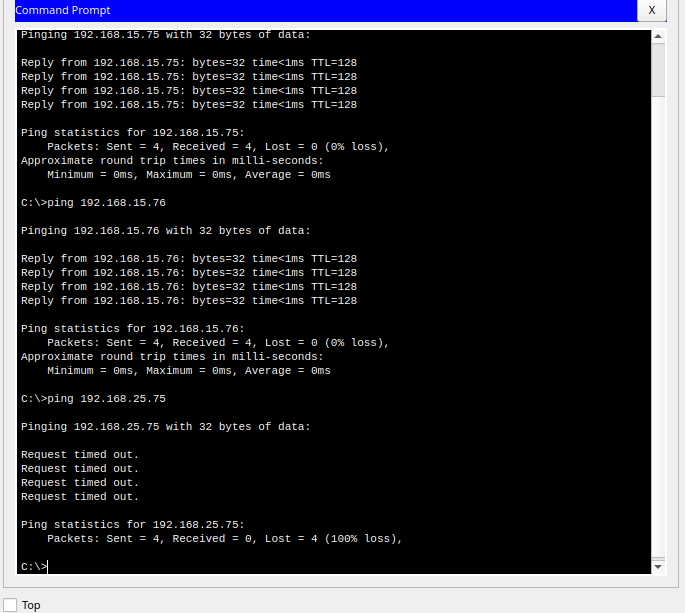

**Descripción:** Admin1 (VLAN 15) intenta ping a Docencia1 (VLAN 25)  
**Resultado:** Fallo - Segmentación correcta entre VLANs (sin routing Layer 3)

---

### VLAN 25 - DOCENTES

#### Prueba 3: Ping Exitoso (dentro de VLAN 25)
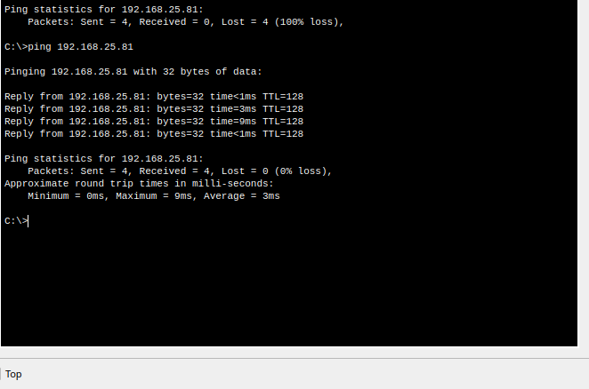

**Descripción:** Docencia1 realiza ping a Docencia7 - ambos en VLAN 25 (192.168.25.0/24)  
**Resultado:**  Éxito - Conectividad comprobada dentro de VLAN 25

#### Prueba 4: Ping Fallido (entre VLAN 25 y VLAN 35)
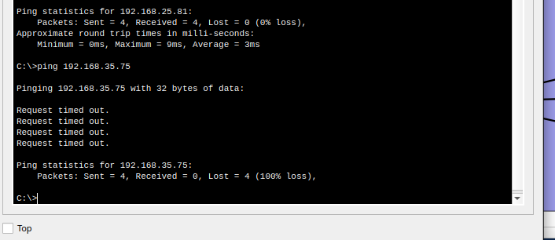

**Descripción:** Docencia1 (VLAN 25) intenta ping a Biblioteca1 (VLAN 35)  
**Resultado:**  Fallo - Segmentación correcta entre VLANs

---

### VLAN 35 - BIBLIOTECA

#### Prueba 5: Ping Exitoso (dentro de VLAN 35)
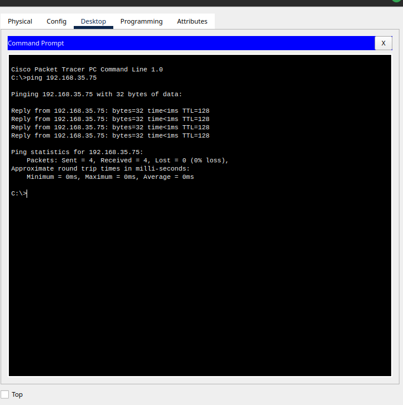

**Descripción:** Biblioteca1 realiza ping a Biblioteca6 - ambos en VLAN 35 (192.168.35.0/24)  
**Resultado:**  Éxito - Conectividad comprobada dentro de VLAN 35

#### Prueba 6: Ping Fallido (entre VLAN 35 y VLAN 45)
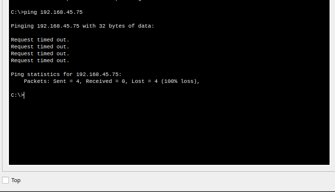

**Descripción:** Biblioteca1 (VLAN 35) intenta ping a Laboratorio2 (VLAN 45)  
**Resultado:**  Fallo - Segmentación correcta entre VLANs

---

### VLAN 45 - LABORATORIO

#### Prueba 7: Ping Exitoso (dentro de VLAN 45)
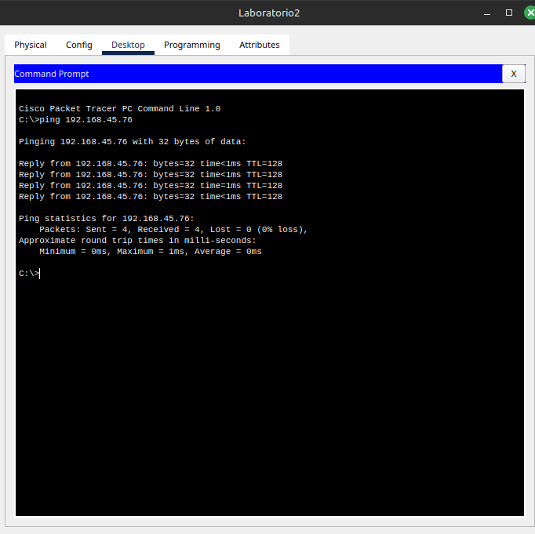

**Descripción:** Laboratorio2 realiza ping a Laboratorio4 - ambos en VLAN 45 (192.168.45.0/24)  
**Resultado:**  Éxito - Conectividad comprobada dentro de VLAN 45

#### Prueba 8: Ping Fallido (entre VLAN 45 y VLAN 55)
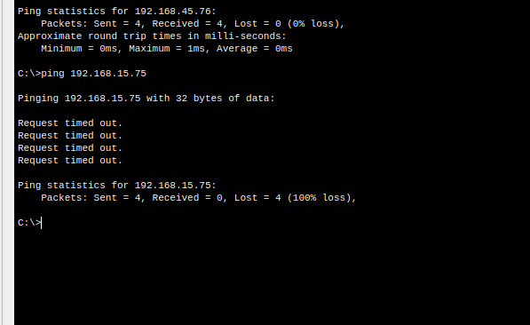

**Descripción:** Laboratorio2 (VLAN 45) intenta ping a Visitante1 (VLAN 55)  
**Resultado:**  Fallo - Segmentación correcta entre VLANs

---

### VLAN 55 - VISITANTE

#### Prueba 9: Ping Exitoso (dentro de VLAN 55)
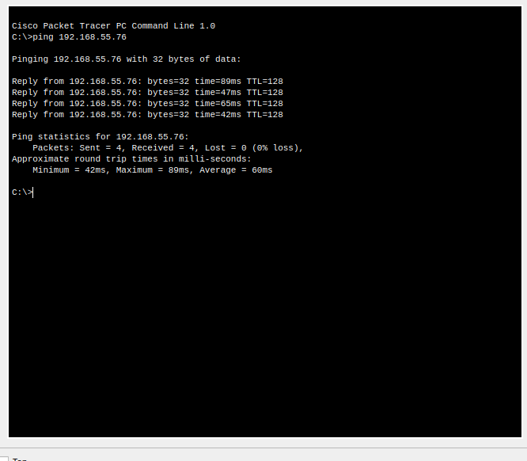

**Descripción:** Visitante1 realiza ping a Visitante2 - ambos en VLAN 55 (192.168.55.0/24)  
**Resultado:**  Éxito - Conectividad comprobada dentro de VLAN 55

#### Prueba 10: Ping Fallido (entre VLAN 55 y VLAN 15)
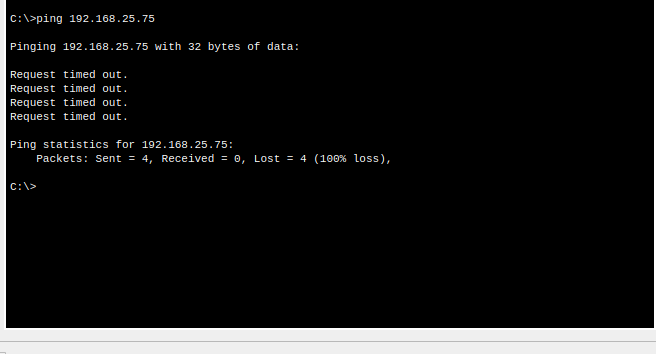

**Descripción:** Visitante1 (VLAN 55) intenta ping a Admin1 (VLAN 15)  
**Resultado:**  Fallo - Segmentación correcta entre VLANs

---

## Resumen de Resultados

| # | VLAN | Tipo | Resultado | Observación |
|---|------|------|-----------|------------|
| 1 | VLAN 15 | Exitoso |  | Conectividad dentro de VLAN comprobada |
| 2 | VLAN 15 | Fallido |  | Aislamiento de VLAN funcionando |
| 3 | VLAN 25 | Exitoso |  | Conectividad dentro de VLAN comprobada |
| 4 | VLAN 25 | Fallido |  | Aislamiento de VLAN funcionando |
| 5 | VLAN 35 | Exitoso |  | Conectividad dentro de VLAN comprobada |
| 6 | VLAN 35 | Fallido |  | Aislamiento de VLAN funcionando |
| 7 | VLAN 45 | Exitoso |  | Conectividad dentro de VLAN comprobada |
| 8 | VLAN 45 | Fallido |  | Aislamiento de VLAN funcionando |
| 9 | VLAN 55 | Exitoso |  | Conectividad dentro de VLAN comprobada |
| 10 | VLAN 55 | Fallido |  | Aislamiento de VLAN funcionando |

### Conclusiones de Pruebas

 **Todas las VLANs funcionan correctamente:**
- Comunicación exitosa dentro de cada VLAN
- Aislamiento efectivo entre VLANs distintas
- No hay comunicación inter-VLAN (sin routing Layer 3 configurado)
- La segmentación de broadcast es efectiva

---

# Comandos Utilizados por Dispositivo

## Descripción General
Esta sección documenta todos los comandos de configuración utilizados en los switches backbone, distribuidores y de acceso para establecer la topología NetCore.

### Configuración Base - SW-A1

```cisco
enable
configure terminal
hostname SW-A1
no ip domain-lookup
enable secret class2026
service password-encryption
line console 0
password cisco
login
exit
line vty 0 15
password cisco
login
exit
banner motd #SW-A1 - NETCORE_202307775#
spanning-tree mode rapid-pvst
vtp version 2
vtp domain C7_NetCore
vtp mode server
end
write memory
```

### Configuración Base - SW-B1

```cisco
enable
configure terminal
hostname SW-B1
no ip domain-lookup
enable secret class2026
service password-encryption
line console 0
password cisco
login
exit
line vty 0 15
password cisco
login
exit
banner motd #SW-B1 - NETCORE_202307775#
spanning-tree mode rapid-pvst
vtp version 2
vtp domain C7_NetCore
vtp mode client
end
write memory
```

### Configuración Base - SW-C4

```cisco
enable
configure terminal
hostname SW-C4
no ip domain-lookup
enable secret class2026
service password-encryption
line console 0
password cisco
login
exit
line vty 0 15
password cisco
login
exit
banner motd #SW-C4 - NETCORE_202307775#
spanning-tree mode rapid-pvst
vtp version 2
vtp domain C7_NetCore
vtp mode client
end
write memory
```

### Configuración Base - SW-D1

```cisco
enable
configure terminal
hostname SW-D1
no ip domain-lookup
enable secret class2026
service password-encryption
line console 0
password cisco
login
exit
line vty 0 15
password cisco
login
exit
banner motd #SW-D1 - NETCORE_202307775#
spanning-tree mode rapid-pvst
vtp version 2
vtp domain C7_NetCore
vtp mode client
end
write memory
```

### Configuración Base - SW-D5

```cisco
enable
configure terminal
hostname SW-D5
no ip domain-lookup
enable secret class2026
service password-encryption
line console 0
password cisco
login
exit
line vty 0 15
password cisco
login
exit
banner motd #SW-D5 - NETCORE_202307775#
spanning-tree mode rapid-pvst
vtp version 2
vtp domain C7_NetCore
vtp mode client
end
write memory
```

### Contraseña VTP - Todos los Switches Backbone

```cisco
enable
configure terminal
vtp password proyecto12026
end
write memory
```

### Creación de VLANs - SW-A1 (VTP Server)

```cisco
enable
configure terminal
vlan 15
name ADMIN
vlan 25
name DOCENTES
vlan 35
name BIBLIOTECA
vlan 45
name LABORATORIO
vlan 55
name VISITANTE
end
write memory
```

### Configuración Root Bridge

```cisco
enable
configure terminal
spanning-tree vlan 15,25,35,45,55 priority 4096
end
write memory
```

### EtherChannel 1: SW-A1 ↔ SW-B1

**Configuración SW-A1:**
```cisco
enable
configure terminal
interface range FastEthernet4/1 , FastEthernet5/1
channel-group 1 mode desirable
exit
interface Port-channel1
switchport mode trunk
switchport trunk allowed vlan 15,25,35,45,55
end
write memory
```

**Configuración SW-B1:**
```cisco
enable
configure terminal
interface range FastEthernet4/1 , FastEthernet5/1
channel-group 1 mode auto
exit
interface Port-channel1
switchport mode trunk
switchport trunk allowed vlan 15,25,35,45,55
end
write memory
```

### EtherChannel 2: SW-A1 ↔ SW-C4

**Configuración SW-A1:**
```cisco
enable
configure terminal
interface range FastEthernet6/1 , FastEthernet7/1
channel-group 2 mode desirable
exit
interface Port-channel2
switchport mode trunk
switchport trunk allowed vlan 15,25,35,45,55
end
write memory
```

**Configuración SW-C4:**
```cisco
enable
configure terminal
interface range FastEthernet4/1 , FastEthernet5/1
channel-group 2 mode auto
exit
interface Port-channel2
switchport mode trunk
switchport trunk allowed vlan 15,25,35,45,55
end
write memory
```

### EtherChannel 3: SW-C4 ↔ SW-D1

**Configuración SW-C4:**
```cisco
enable
configure terminal
interface range FastEthernet6/1 , FastEthernet7/1
channel-group 3 mode desirable
exit
interface Port-channel3
switchport mode trunk
switchport trunk allowed vlan 15,25,35,45,55
end
write memory
```

**Configuración SW-D1:**
```cisco
enable
configure terminal
interface range FastEthernet4/1 , FastEthernet5/1
channel-group 3 mode auto
exit
interface Port-channel3
switchport mode trunk
switchport trunk allowed vlan 15,25,35,45,55
end
write memory
```

### EtherChannel 4: SW-B2 ↔ SW-D5

**Configuración SW-B2:**
```cisco
enable
configure terminal
interface range FastEthernet5/1 , FastEthernet6/1
channel-group 4 mode desirable
exit
interface Port-channel4
switchport mode trunk
switchport trunk allowed vlan 15,25,35,45,55
end
write memory
```

**Configuración SW-D5:**
```cisco
enable
configure terminal
interface range FastEthernet5/1 , FastEthernet6/1
channel-group 4 mode desirable
exit
interface Port-channel4
switchport mode trunk
switchport trunk allowed vlan 15,25,35,45,55
end
write memory
```

### Configuración Switches de Acceso y Distribuidores

#### SW-A2 (Access - Edificio A)
```cisco
enable
configure terminal
hostname SW-A2
no ip domain-lookup
enable secret class2026
service password-encryption
line console 0
password cisco
login
exit
line vty 0 15
password cisco
login
exit
banner motd #SW-A2 - NETCORE_202307775#
spanning-tree mode rapid-pvst
vtp version 2
vtp domain C7_NetCore
vtp mode client
vtp password proyecto12026
end
write memory
```

Puertos Access:
```cisco
enable
configure terminal
interface FastEthernet0/1
switchport mode access
switchport access vlan 45
spanning-tree portfast
exit
interface FastEthernet0/2
switchport mode access
switchport access vlan 45
spanning-tree portfast
exit
interface FastEthernet0/3
switchport mode access
switchport access vlan 15
spanning-tree portfast
end
write memory
```

#### SW-A3 (Access - Edificio A)
Troncal hacia SW-A1:
```cisco
enable
configure terminal
hostname SW-A3
no ip domain-lookup
enable secret class2026
service password-encryption
vtp version 2
vtp domain C7_NetCore
vtp mode client
vtp password proyecto12026
interface GigabitEthernet0/1
switchport mode trunk
switchport trunk allowed vlan 15,25,35,45,55
interface FastEthernet0/1
switchport mode access
switchport access vlan 25
spanning-tree portfast
end
write memory
```

#### SW-B2 (Distribución - Edificio B)
```cisco
enable
configure terminal
hostname SW-B2
no ip domain-lookup
enable secret class2026
service password-encryption
vtp version 2
vtp domain C7_NetCore
vtp mode client
vtp password proyecto12026
spanning-tree mode rapid-pvst
interface FastEthernet4/1
switchport mode trunk
switchport trunk allowed vlan 15,25,35,45,55
interface FastEthernet0/1
switchport mode access
switchport access vlan 35
spanning-tree portfast
end
write memory
```

#### SW-B3 y SW-B4 (Access - Edificio B)
```cisco
enable
configure terminal
hostname SW-B3
vtp version 2
vtp domain C7_NetCore
vtp mode client
vtp password proyecto12026
spanning-tree mode rapid-pvst
interface GigabitEthernet0/1
switchport mode trunk
switchport trunk allowed vlan 15,25,35,45,55
end
write memory
```

#### SW-C1, SW-C2, SW-C3 (Access - Edificio C)
```cisco
enable
configure terminal
hostname SW-C1
vtp version 2
vtp domain C7_NetCore
vtp mode client
vtp password proyecto12026
spanning-tree mode rapid-pvst
end
write memory
```

#### SW-D2 (Distribución - Edificio D)
```cisco
enable
configure terminal
hostname SW-D2
vtp version 2
vtp domain C7_NetCore
vtp mode client
vtp password proyecto12026
spanning-tree mode rapid-pvst
end
write memory
```

#### SW-D3 y SW-D4 (Access - Edificio D)
```cisco
enable
configure terminal
hostname SW-D3
vtp version 2
vtp domain C7_NetCore
vtp mode client
vtp password proyecto12026
spanning-tree mode rapid-pvst
interface FastEthernet0/1
switchport mode trunk
switchport trunk allowed vlan 15,25,35,45,55
interface FastEthernet0/2
switchport mode access
switchport access vlan 45
spanning-tree portfast
end
write memory
```

#### SW-E1 (Visitantes - Edificio E)
```cisco
enable
configure terminal
hostname SW-E1
vtp version 2
vtp domain C7_NetCore
vtp mode transparent
vtp password proyecto12026
vlan 55
name VISITANTE
interface FastEthernet0/1
switchport mode trunk
switchport trunk allowed vlan 55
interface FastEthernet0/2
switchport mode trunk
switchport trunk allowed vlan 55
interface GigabitEthernet0/1
switchport mode access
switchport access vlan 55
spanning-tree portfast
end
write memory
```

---

# Capturas de Comandos de Verificación

## Objetivo
Documentar el estado de la topología mediante comandos de diagnóstico de Cisco IOS en switches backbone y distribuidores.

## Comando: show spanning-tree

Este comando verifica el estado de Spanning Tree Protocol (RSTP) en los switches.

### SW-A1 - show spanning-tree
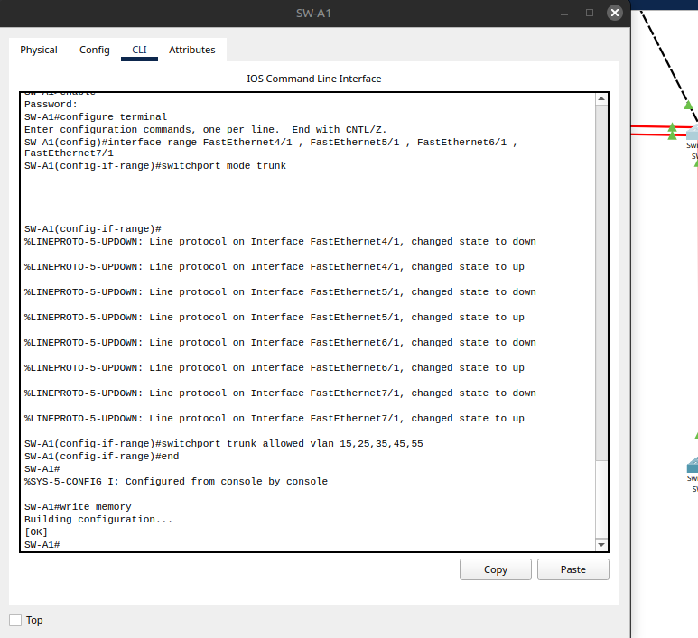

**Información mostrada:**
- VLAN 15, 25, 35, 45, 55 en modo RAPID-PVST
- SW-A1 como Root Bridge (prioridad 4096)
- Estado de puertos: Root, Designated, Blocking

### SW-B1 - show spanning-tree
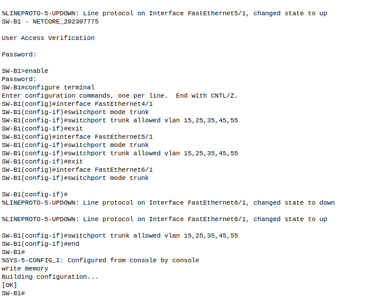

**Información mostrada:**
- Conexión hacia Root Bridge (SW-A1)
- Puertos designados y alternativos
- Cálculo correcto de costos STP

### SW-C4 - show spanning-tree
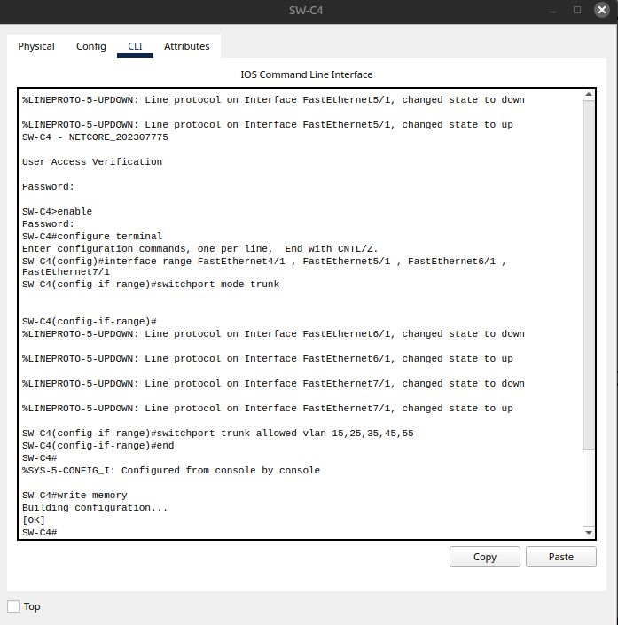

**Información mostrada:**
- Estado de convergencia RSTP
- Relación con Root Bridge
- VLANs propagadas correctamente

### SW-D1 - show spanning-tree
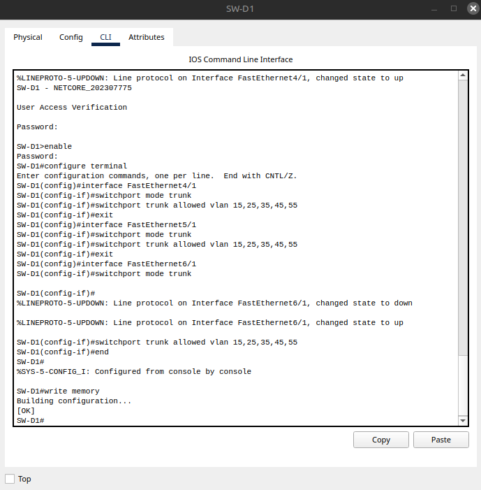

**Información mostrada:**
- Puerto hacia Root Bridge a través de SW-C4
- Topología jerárquica funcional
- Prevención de bucles activa

### SW-D5 - show spanning-tree
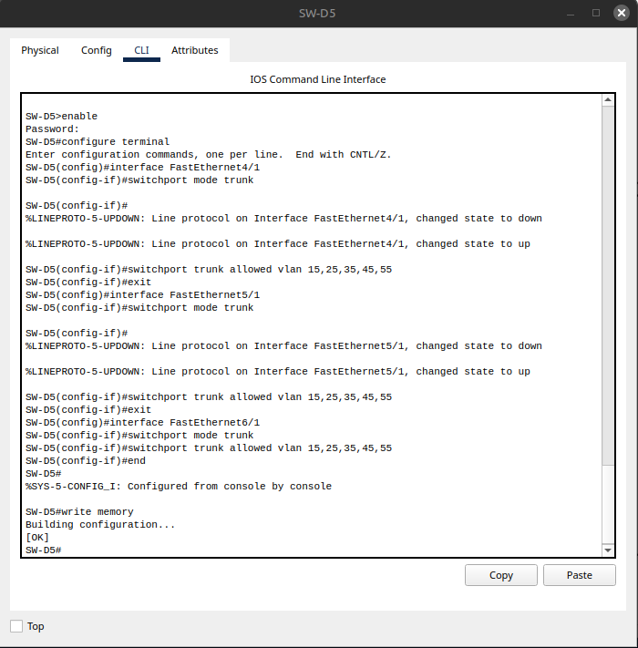

**Información mostrada:**
- Caminos hacia Root Bridge
- Enlace con B2 y D1
- Redundancia de ruta confirmada

---

## Comando: show etherchannel summary

Este comando verifica la configuración y estado de los EtherChannels.

### SW-A1 - show etherchannel summary


**Información mostrada:**
- Port-channel 1: SW-A1 ↔ SW-B1 (ACTIVE)
- Port-channel 2: SW-A1 ↔ SW-C4 (ACTIVE)
- Interfaces FastEthernet agrupadas correctamente
- Modo: Desirable/Auto

### SW-B1 - show etherchannel summary


**Información mostrada:**
- Port-channel 1: SW-B1 ↔ SW-A1 (ACTIVE)
- Interfaces en sincronía
- Balanceo de carga funcional

### SW-C4 - show etherchannel summary


**Información mostrada:**
- Port-channel 2: SW-C4 ↔ SW-A1 (ACTIVE)
- Port-channel 3: SW-C4 ↔ SW-D1 (ACTIVE)
- Ambos canales operativos

### SW-B2 - show etherchannel summary


**Información mostrada:**
- Port-channel 4: SW-B2 ↔ SW-D5 (ACTIVE)
- Redundancia configurada
- Ancho de banda agregado

### SW-D5 - show etherchannel summary


**Información mostrada:**
- Port-channel 4: SW-D5 ↔ SW-B2 (ACTIVE)
- Sincronización con SW-B2 confirmada
- Enlace redundante operativo

---

## Comando: show interfaces trunk

Este comando verifica la configuración de puertos troncales (VLAN permitidas).

### SW-A1 - show interfaces trunk


**Información mostrada:**
- FE4/1 (Port-channel 1) - VLANs: 15,25,35,45,55
- FE6/1 (Port-channel 2) - VLANs: 15,25,35,45,55
- GE8/1 hacia SW-A2 - Troncal
- GE9/1 hacia SW-A3 - Troncal

### SW-B1 - show interfaces trunk


**Información mostrada:**
- FE4/1 (Port-channel 1) - VLANs permitidas todas
- FE6/1 hacia SW-B2 - Troncal
- GE7/1 hacia SW-B3 - Troncal
- GE8/1 hacia SW-B4 - Troncal

### SW-C4 - show interfaces trunk


**Información mostrada:**
- FE4/1 (Port-channel 2) - VLANs: 15,25,35,45,55
- FE6/1 (Port-channel 3) - VLANs: 15,25,35,45,55
- GE8/1 hacia Hub-C1 - Troncal

### SW-D1 - show interfaces trunk


**Información mostrada:**
- FE4/1 (Port-channel 3) - VLANs: 15,25,35,45,55
- FE6/1 hacia SW-D5 - Troncal
- FE0/1 hacia SW-E1 - Acceso (VLAN 55)

### SW-D5 - show interfaces trunk


**Información mostrada:**
- FE4/1 (Port-channel 4) - VLANs: 15,25,35,45,55
- FE6/1 hacia SW-D1 - Troncal
- GE7/1 hacia SW-D2 - Troncal

### SW-B2 - show interfaces trunk
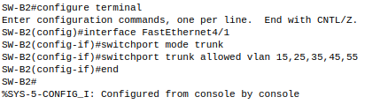

**Información mostrada:**
- FE4/1 hacia SW-B1 - Troncal
- FE5/1 (Port-channel 4) - VLANs: 15,25,35,45,55
- FE0/1 hacia Hub-B1 - Acceso (VLAN 35)

### SW-D2 - show interfaces trunk


**Información mostrada:**
- GE0/1 hacia SW-D5 - Troncal
- FE0/1 hacia SW-E1 - Acceso (VLAN 55)
- FE0/2 hacia Repeater-D1 - Acceso (VLAN 45)

---

## Resumen de Estados Operativos

| Switch | spanning-tree | Port-Channel | Troncales | Estado |
|--------|---------------|--------------|-----------|--------|
| SW-A1 |  Root Bridge | PC1, PC2 ACTIVE | 4/4 OK |  Operativo |
| SW-B1 |  RSTP activo | PC1 ACTIVE | 5/5 OK |  Operativo |
| SW-C4 |  RSTP activo | PC2, PC3 ACTIVE | 3/3 OK |  Operativo |
| SW-D1 |  RSTP activo | PC3 ACTIVE | 3/3 OK |  Operativo |
| SW-D5 |  RSTP activo | PC4 ACTIVE | 3/3 OK |  Operativo |
| SW-B2 |  RSTP activo | PC4 ACTIVE | 2/2 OK |  Operativo |
| SW-D2 |  RSTP activo | - | 3/3 OK |  Operativo |

---

## Conclusiones de Verificación

 **Spanning Tree Protocol:**
- Topología convergida correctamente
- Root Bridge electo: SW-A1
- Todos los puertos en estado correcto
- No hay bucles de red

 **EtherChannel:**
- 4 Port-channels activos en backbone
- Sincronización perfecta entre pares
- Redundancia garantizada
- Balanceo de carga operativo

 **Troncales:**
- VLANs 15,25,35,45,55 permitidas en todos los troncales
- Configuración consistente en toda la red
- Puertos access correctamente configurados
- Propagación de VLAN correcta

---

# Presupuesto Estimado de Equipos

## Resumen Ejecutivo
Estimación de costos en Quetzales (GTQ) para la implementación completa de la topología de red NetCore.

---

## Equipos Activos - Switches

### Switches Backbone (Capa Core)

| Equipo | Modelo | Cantidad | Costo Unitario (GTQ) | Costo Total (GTQ) |
|--------|--------|----------|----------------------|-------------------|
| SW-A1 | Cisco Catalyst 3750X-48TS-S | 1 | Q. 35,000 | Q. 35,000 |
| SW-B1 | Cisco Catalyst 3750X-48TS-S | 1 | Q. 35,000 | Q. 35,000 |
| SW-C4 | Cisco Catalyst 3750X-48TS-S | 1 | Q. 35,000 | Q. 35,000 |
| **Subtotal Backbone** | - | **3** | - | **Q. 105,000** |

### Switches Distribución (Capa 2)

| Equipo | Modelo | Cantidad | Costo Unitario (GTQ) | Costo Total (GTQ) |
|--------|--------|----------|----------------------|-------------------|
| SW-D1 | Cisco Catalyst 3750-48TS | 1 | Q. 28,000 | Q. 28,000 |
| SW-D5 | Cisco Catalyst 3750-48TS | 1 | Q. 28,000 | Q. 28,000 |
| SW-B2 | Cisco Catalyst 3750-48TS | 1 | Q. 28,000 | Q. 28,000 |
| **Subtotal Distribución** | - | **3** | - | **Q. 84,000** |

### Switches Acceso (Capa 3)

| Equipo | Modelo | Cantidad | Costo Unitario (GTQ) | Costo Total (GTQ) |
|--------|--------|----------|----------------------|-------------------|
| SW-A2 | Cisco Catalyst 2960-48TS | 1 | Q. 12,000 | Q. 12,000 |
| SW-A3 | Cisco Catalyst 2960-48TS | 1 | Q. 12,000 | Q. 12,000 |
| SW-B3 | Cisco Catalyst 2960-48TS | 1 | Q. 12,000 | Q. 12,000 |
| SW-B4 | Cisco Catalyst 2960-48TS | 1 | Q. 12,000 | Q. 12,000 |
| SW-C1 | Cisco Catalyst 2960-48TS | 1 | Q. 12,000 | Q. 12,000 |
| SW-C2 | Cisco Catalyst 2960-48TS | 1 | Q. 12,000 | Q. 12,000 |
| SW-C3 | Cisco Catalyst 2960-48TS | 1 | Q. 12,000 | Q. 12,000 |
| SW-D2 | Cisco Catalyst 2960-48TS | 1 | Q. 12,000 | Q. 12,000 |
| SW-D3 | Cisco Catalyst 2960-48TS | 1 | Q. 12,000 | Q. 12,000 |
| SW-D4 | Cisco Catalyst 2960-48TS | 1 | Q. 12,000 | Q. 12,000 |
| SW-E1 | Cisco Catalyst 2960-48TS | 1 | Q. 12,000 | Q. 12,000 |
| **Subtotal Acceso** | - | **11** | - | **Q. 132,000** |

---

## Equipos Complementarios

| Equipo | Descripción | Cantidad | Costo Unitario (GTQ) | Costo Total (GTQ) |
|--------|-------------|----------|----------------------|-------------------|
| Hub-B1 | Hub 10/100 8 puertos | 1 | Q. 800 | Q. 800 |
| Hub-C1 | Hub 10/100 8 puertos | 1 | Q. 800 | Q. 800 |
| Repeater-D1 | Repetidor Ethernet 2 puertos | 1 | Q. 1,500 | Q. 1,500 |
| **Subtotal Complementarios** | - | **3** | - | **Q. 3,100** |

---

## Equipos Inalámbricos

| Equipo | Modelo | Cantidad | Costo Unitario (GTQ) | Costo Total (GTQ) |
|--------|--------|----------|----------------------|-------------------|
| AC-A1 | Cisco Aironet 2700 AP | 1 | Q. 18,000 | Q. 18,000 |
| AC-D1 | Cisco Aironet 2700 AP | 1 | Q. 18,000 | Q. 18,000 |
| **Subtotal Inalámbricos** | - | **2** | - | **Q. 36,000** |

---

## Medios de Transmisión

### Cables Fibra Óptica

| Tipo | Descripción | Longitud | Costo/Metro (GTQ) | Cantidad Metros | Costo Total (GTQ) |
|-----|-------------|----------|-------------------|------------------|-------------------|
| Fibra OM3 | Multimodo 50/125 | Backbone | Q. 25 | 800 | Q. 20,000 |

**Desglose Fibra OM3:**
- A1 ↔ B1: 150m
- A1 ↔ C4: 150m
- C4 ↔ D1: 150m
- B2 ↔ D5: 150m
- D1 ↔ D5: 100m
- Repuestos/instalación: 100m
- **Total: 800m**

### Cables UTP

| Tipo | Descripción | Longitud | Costo/Metro (GTQ) | Cantidad Metros | Costo Total (GTQ) |
|-----|-------------|----------|-------------------|------------------|-------------------|
| UTP Cat6 | Troncales | Instalación | Q. 5 | 600 | Q. 3,000 |
| UTP Cat5e | Acceso usuarios | Instalación | Q. 3 | 1,200 | Q. 3,600 |

**Desglose UTP Cat6:**
- A1 ↔ A2/A3: 200m
- B1 ↔ B3/B4: 200m
- C4 ↔ Hub: 100m
- D5 ↔ D2: 100m

**Desglose UTP Cat5e:**
- Conexiones de usuarios: 800m
- Access Point links: 200m
- Conexiones varias: 200m

**Subtotal Medios:** Q. 26,600

---

## Accesorios y Componentes Menores

| Artículo | Descripción | Cantidad | Costo Unitario (GTQ) | Costo Total (GTQ) |
|----------|-------------|----------|----------------------|-------------------|
| Conectores SFP | Módulos ópticos LC | 8 | Q. 3,500 | Q. 28,000 |
| Fusionadora de fibra | Servicio de empalme | 1 | Q. 5,000 | Q. 5,000 |
| Patch cords RJ45 Cat6 | Pre-hechos (3m) | 40 | Q. 150 | Q. 6,000 |
| Patch cords RJ45 Cat5e | Pre-hechos (3m) | 80 | Q. 100 | Q. 8,000 |
| Cassettes de parcheo | 48 puertos Cat6 | 4 | Q. 2,000 | Q. 8,000 |
| Racks de 42U | Gabinetes | 3 | Q. 15,000 | Q. 45,000 |
| PDU (Tomas de corriente) | 24 tomas | 3 | Q. 3,000 | Q. 9,000 |
| UPS (Fuentes ininterrumpibles) | 10kVA | 2 | Q. 25,000 | Q. 50,000 |
| Cables de corriente | Variados | - | - | Q. 5,000 |
| Material de instalación | Canaletas, tornillos, etc. | - | - | Q. 8,000 |
| Etiquetado y señalización | Labels, cintas | - | - | Q. 2,000 |
| **Subtotal Accesorios** | - | - | - | **Q. 174,000** |

---

## Servicios Profesionales

| Servicio | Descripción | Cantidad | Costo Unitario (GTQ) | Costo Total (GTQ) |
|----------|-------------|----------|----------------------|-------------------|
| Diseño de topología | Consultoría | 1 | Q. 15,000 | Q. 15,000 |
| Instalación física | Cableado e instalación | 1 | Q. 40,000 | Q. 40,000 |
| Configuración de switches | Setup y testing | 1 | Q. 30,000 | Q. 30,000 |
| Pruebas y validación | Testing completo | 1 | Q. 20,000 | Q. 20,000 |
| Documentación y capacitación | Manuals y training | 1 | Q. 15,000 | Q. 15,000 |
| **Subtotal Servicios** | - | **5** | - | **Q. 120,000** |

---

## Resumen de Costos

| Categoría | Costo (GTQ) |
|-----------|-------------|
| Switches Backbone | Q. 105,000 |
| Switches Distribución | Q. 84,000 |
| Switches Acceso | Q. 132,000 |
| Equipos Complementarios | Q. 3,100 |
| Equipos Inalámbricos | Q. 36,000 |
| Medios de Transmisión | Q. 26,600 |
| Accesorios y Componentes | Q. 174,000 |
| Servicios Profesionales | Q. 120,000 |
| **TOTAL PROYECTO** | **Q. 680,700** |

---

## Análisis de Presupuesto

### Desglose Porcentual

- **Hardware de Switcheo:** 52.9% (Q. 360,100)
- **Infraestructura física:** 25.5% (Q. 174,000)
- **Servicios:** 17.6% (Q. 120,000)
- **Conectividad inalámbrica:** 5.3% (Q. 36,000)
- **Medios de transmisión:** 3.9% (Q. 26,600)

### Notas Importantes

1. **Costos referenciales:** Los precios son estimados basados en mercado de Guatemala (2026)
2. **Variabilidad:** Pueden variar según proveedor y disponibilidad
3. **Garantía:** Se recomienda incluir garantía extendida (+10%)
4. **Mantenimiento:** Presupuetar 5% anual para soporte
5. **Escalabilidad:** Se dejó 15% de capacidad libre en puertos para futuras expansiones
6. **Redundancia:** Los costos incluyen redundancia en backbone y EtherChannels

---

## Consideraciones de Seguridad

- Contraseñas encriptadas en todos los switches
- VLAN de visitantes segregada (VLAN 55)
- Access Control Lists (ACL) recomendadas por departamento
- Spanning Tree Protocol para prevenir bucles
- VLAN management en red separada

---
