# Manual Técnico - Tarea 4: Enrutamiento Multi-Protocolo e Inter-VLAN
**Estudiante:** Javier Andrés Velásquez Bonilla  
**Carnet:** 202307775  
**Curso:** Redes de Computadoras 1  

---

## 1. Introducción

En esta práctica se implementó una topología de red en Cisco Packet Tracer que integra múltiples tecnologías de capa 2 y capa 3. El objetivo principal fue configurar y validar la conectividad utilizando tres protocolos de enrutamiento dinámico (RIP, OSPF y EIGRP), junto con dos métodos de comunicación Inter-VLAN: SVI (Switch Virtual Interface) y Router-on-a-Stick.

---

## 2. Objetivo

Diseñar e implementar una red funcional que permita la comunicación entre diferentes segmentos mediante el uso de múltiples protocolos de enrutamiento y técnicas de segmentación de red, garantizando conectividad extremo a extremo.

---

## 3. Descripción de la Topología

La topología está compuesta por:

- 3 routers (R1, R2, R3)
- 1 switch capa 3 (3560)
- 2 switches capa 2 (2960)
- 4 hosts (PC0, PC1, PC2, PC3)

### Segmentación de red:

- Área Verde: 192.168.75.0/24
- Área Naranja: 192.168.76.0/24
- Enlaces punto a punto:
  - 10.0.1.0/30
  - 10.0.2.0/30
  - 10.0.3.0/30

---

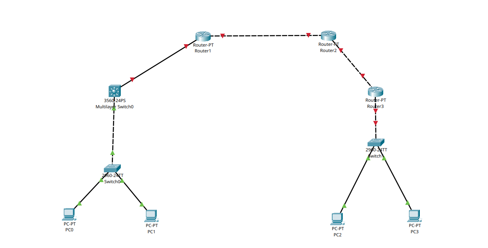

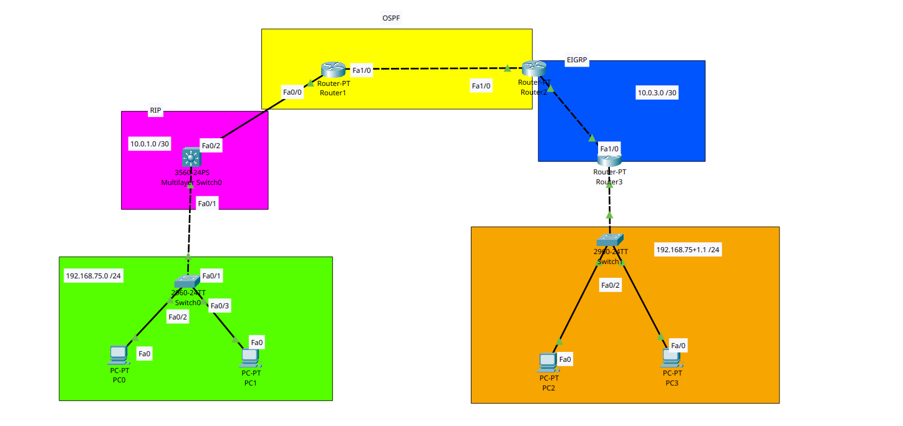

## 4. Proceso de Implementación

### 4.1 Configuración de VLANs

Se crearon dos VLANs por cada área:

- Área Verde:
  - VLAN 10
  - VLAN 20

- Área Naranja:
  - VLAN 30
  - VLAN 40

Se asignaron los puertos correspondientes a cada VLAN y se configuraron enlaces troncales entre dispositivos.

---

### 4.2 Inter-VLAN Routing

#### Lado Izquierdo (Switch 3560 - SVI)

Se configuraron interfaces virtuales para cada VLAN:

- VLAN 10 → Gateway: 192.168.75.1
- VLAN 20 → Gateway: 192.168.75.129

Se habilitó el enrutamiento con:

```bash
ip routing
```

#### Lado Derecho (Router-on-a-Stick)

Se configuraron subinterfaces en el router R3:

- Fa0/0.30 → VLAN 30
- Fa0/0.40 → VLAN 40

Con encapsulación:

```bash
encapsulation dot1Q
```

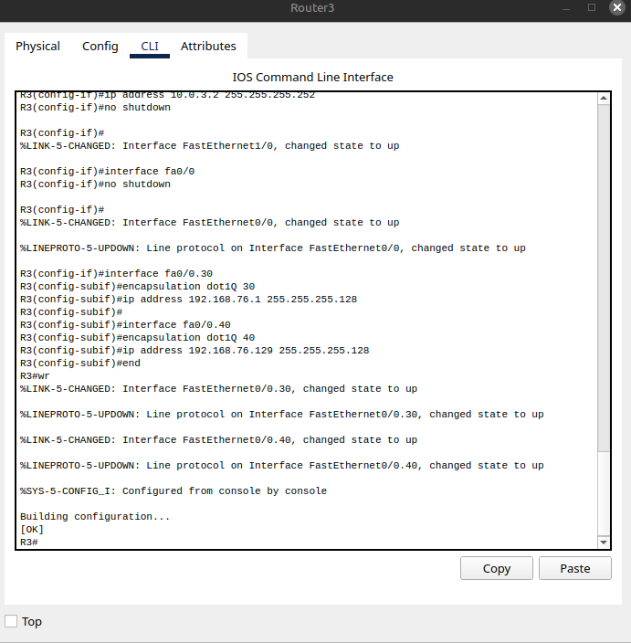
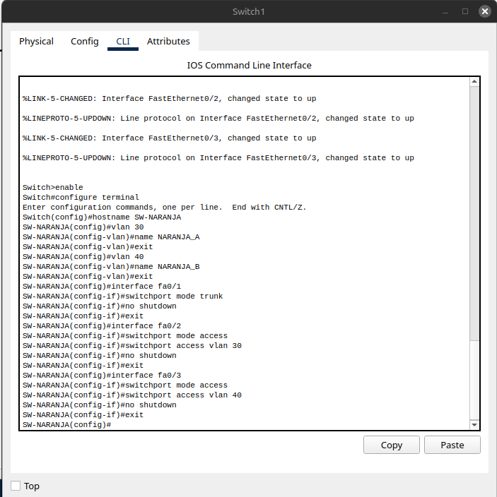

### 4.3 Configuración de Enrutamiento

Se implementaron tres protocolos:

- **RIP (R1 ↔ Switch SVI):** Permite la comunicación con la red del área verde.
- **OSPF (R1 ↔ R2):** Funciona como backbone de la red.
- **EIGRP (R2 ↔ R3):** Permite la conectividad con el área naranja.

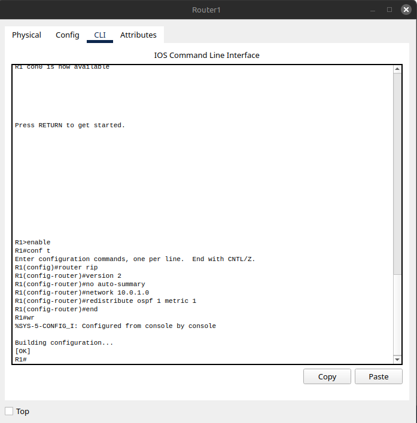
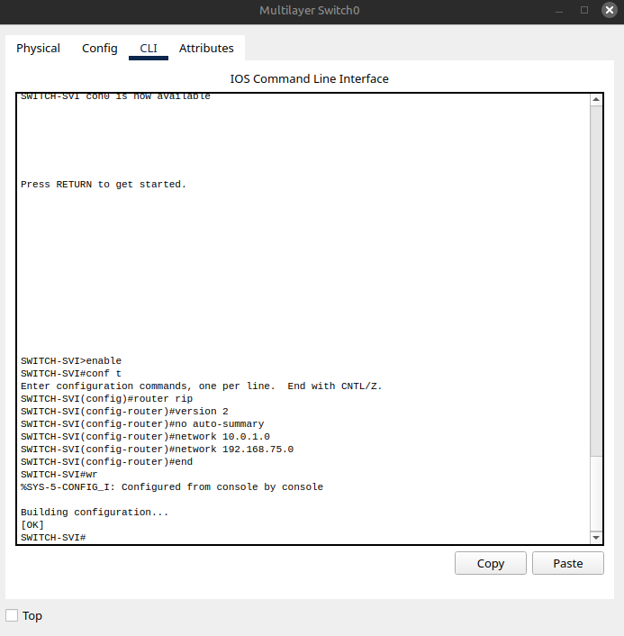
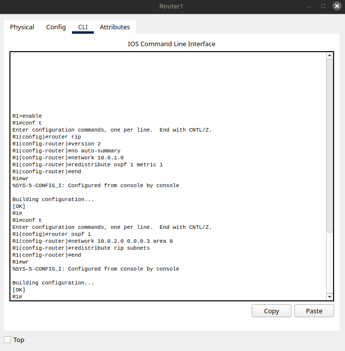
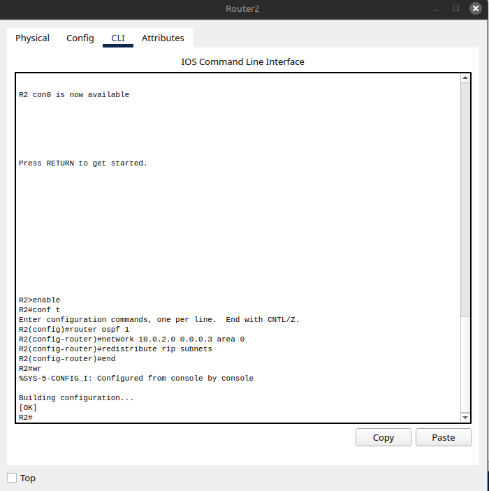
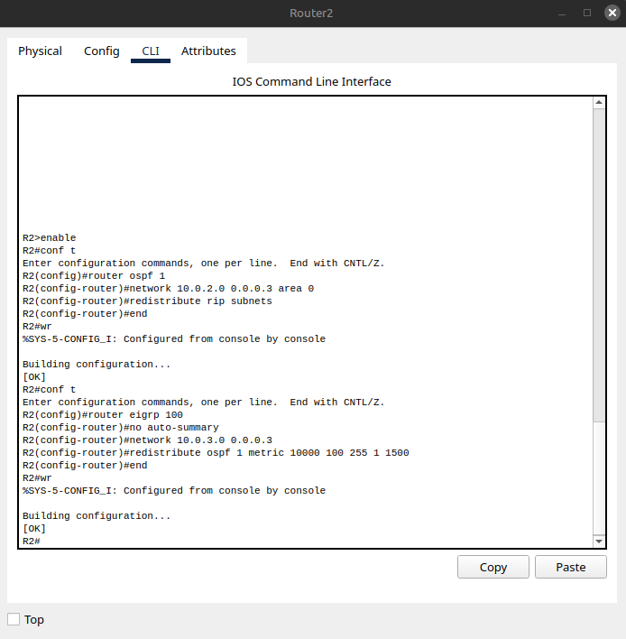
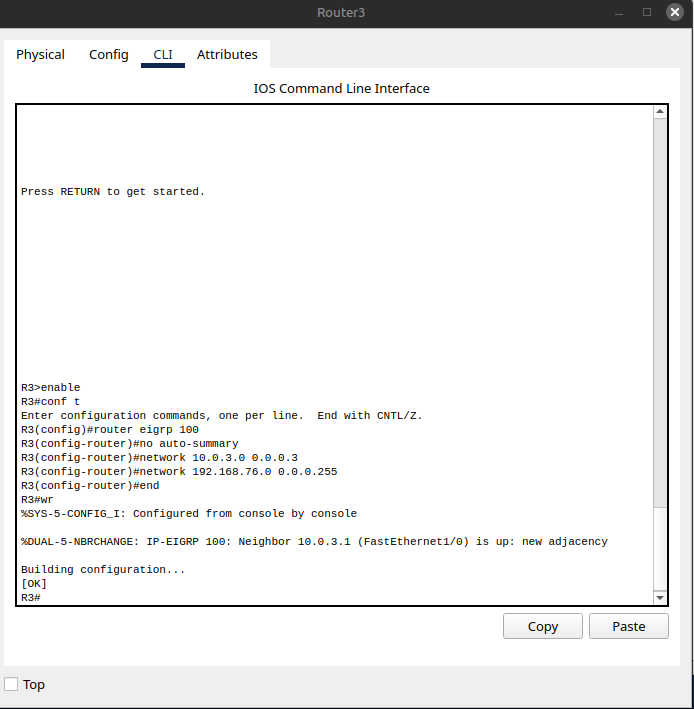

### 4.4 Redistribución de Rutas

Se configuró redistribución para permitir comunicación entre protocolos:

- **R1:** Redistribución RIP ↔ OSPF
- **R2:** Redistribución OSPF ↔ EIGRP

Esto permitió que todas las redes fueran alcanzables entre sí.

## 5. Evidencia de Configuración

### 5.1 Tabla de enrutamiento - R1

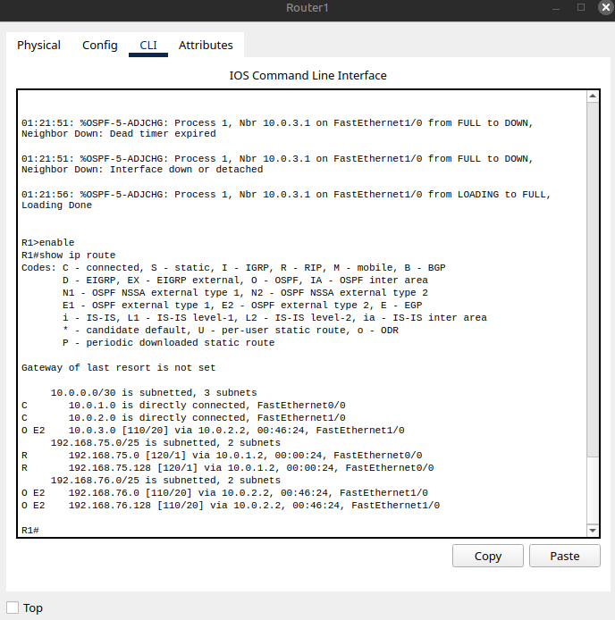

### 5.2 Tabla de enrutamiento - R2

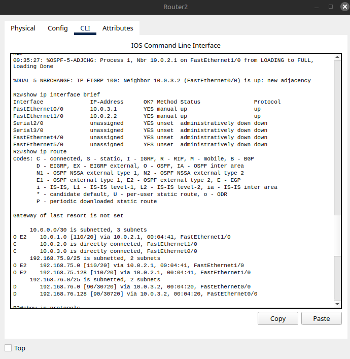

### 5.3 Tabla de enrutamiento - R3

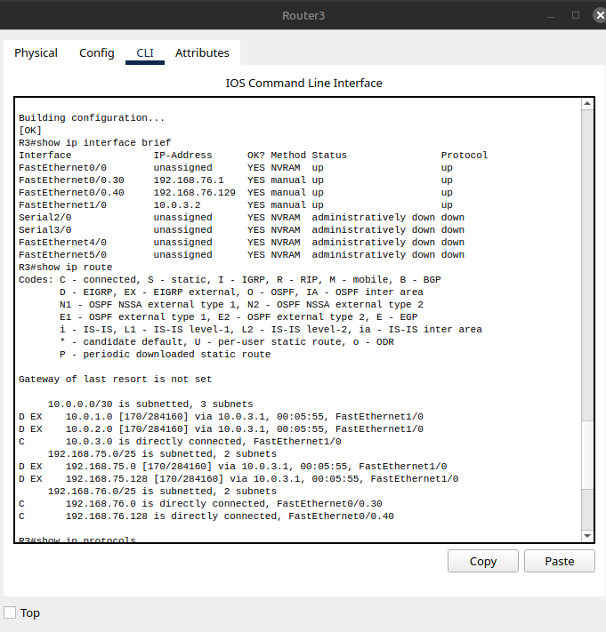

### 5.4 Tabla de enrutamiento - Switch SVI

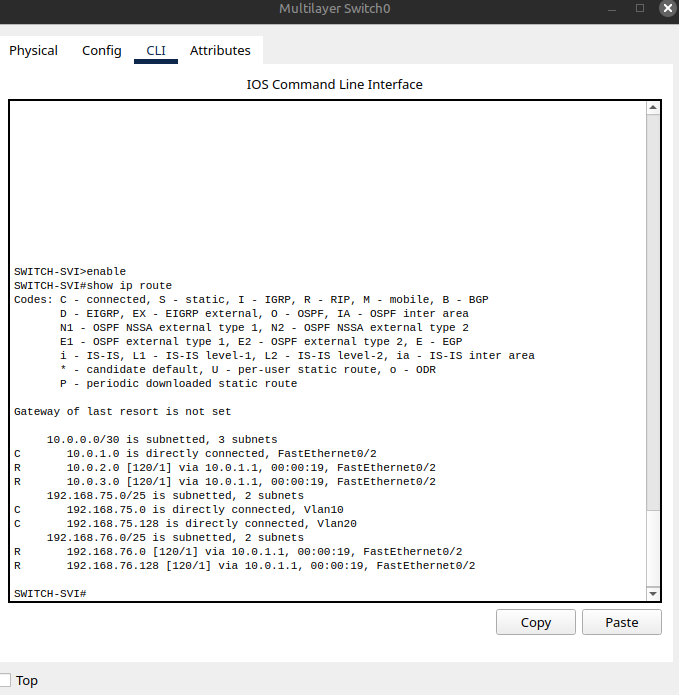

## 6. Pruebas de Conectividad

### 6.1 Ping PC0 → PC3

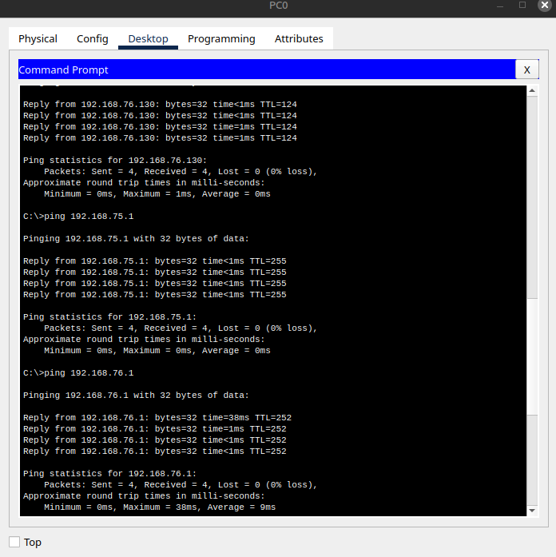

### 6.2 Ping PC3 → PC0

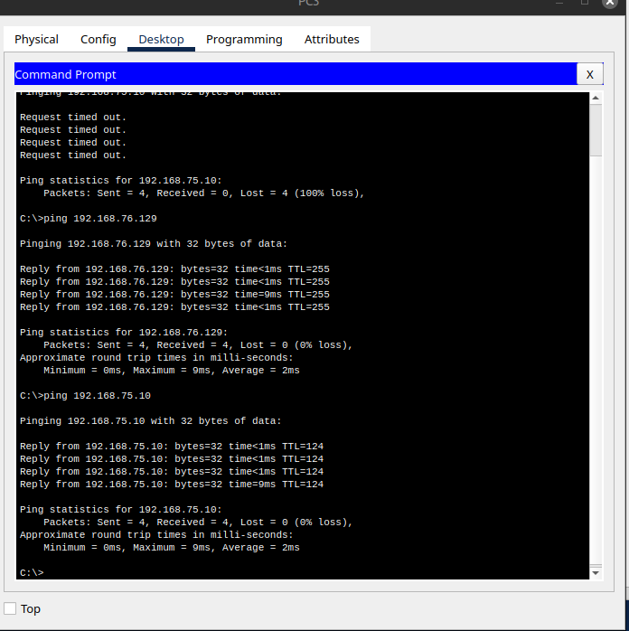

### 6.3 Tabla de Pings

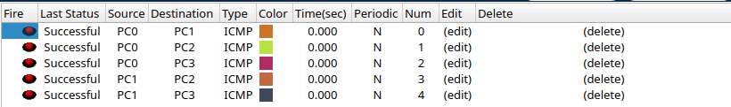

## 7. Resultados

Se logró establecer conectividad total entre todos los dispositivos de la red. Los paquetes ICMP fueron transmitidos exitosamente entre las diferentes VLANs y segmentos de red, validando la correcta implementación del enrutamiento y la redistribución.


## 8. Reflexión

### a. ¿Qué aprendí con esta tarea y cómo enfrenté los errores de configuración?

Durante el desarrollo de esta práctica logré comprender de manera más profunda cómo interactúan diferentes protocolos de enrutamiento dentro de una misma red. En particular, aprendí a implementar RIP, OSPF y EIGRP, así como la importancia crítica de la redistribución de rutas para garantizar la comunicación entre dominios de enrutamiento distintos.

Uno de los principales retos fue la falta de conectividad entre los extremos de la red, a pesar de que las configuraciones iniciales parecían correctas. Este problema se resolvió mediante el análisis de las tablas de enrutamiento (show ip route), lo que permitió identificar que ciertas redes no estaban siendo propagadas correctamente. A partir de esto, comprendí que la redistribución mal configurada puede impedir la comunicación, incluso si los protocolos funcionan de manera individual.

Para solucionar los errores, seguí un proceso lógico de diagnóstico:
- verificación de conectividad por capas (ping a gateway, luego redes remotas),
- revisión de rutas en cada dispositivo,
- análisis de qué protocolo conocía qué redes,
- y finalmente ajuste de la redistribución en los routers.

Este proceso me ayudó a desarrollar una forma más estructurada de resolver problemas en redes.

---

### b. Aplicación práctica

El conocimiento adquirido en esta práctica es altamente aplicable en entornos reales, especialmente en redes empresariales donde coexisten múltiples tecnologías y protocolos de enrutamiento. En la práctica profesional, es común encontrar infraestructuras híbridas donde se requiere integrar diferentes dominios de red, por lo que la redistribución de rutas se vuelve una habilidad fundamental.

Además, la implementación de Inter-VLAN mediante SVI y Router-on-a-Stick es un concepto clave en el diseño de redes segmentadas, lo cual permite mejorar la seguridad, organización y eficiencia del tráfico.

Estas habilidades serán útiles en roles como administrador de redes, ingeniero de soporte o especialista en infraestructura, donde es necesario garantizar la conectividad y diagnosticar fallas complejas de manera eficiente.

---

### c. Conclusión

La realización de esta práctica permitió integrar conocimientos de capa 2 y capa 3 en un mismo escenario, demostrando que la conectividad total en una red depende tanto de una correcta segmentación (VLANs) como de una adecuada implementación del enrutamiento dinámico.

El uso de múltiples protocolos (RIP, OSPF y EIGRP) evidenció la necesidad de comprender no solo su configuración individual, sino también cómo interactúan entre sí mediante redistribución. La validación mediante pruebas de conectividad confirmó el correcto funcionamiento de la red.

En conclusión, esta práctica fortaleció las habilidades técnicas necesarias para diseñar, implementar y solucionar problemas en redes complejas, acercando el aprendizaje a escenarios reales de infraestructura de red.